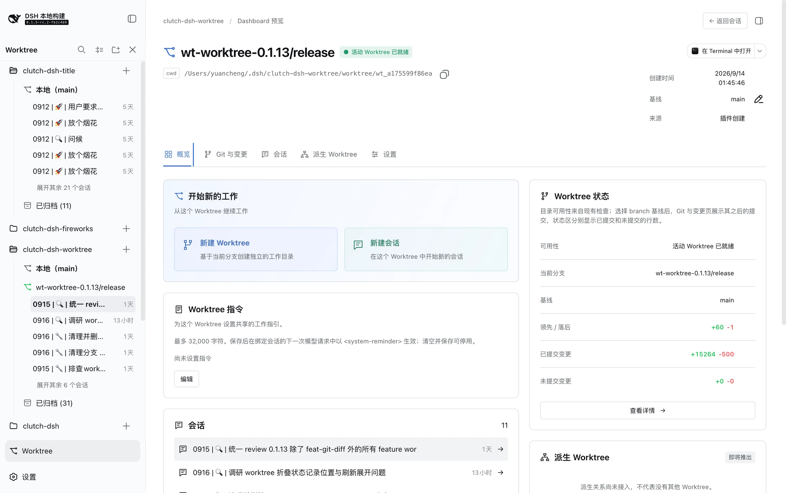

[English](README.md) | [简体中文](README.zh.md)

# clutch-dsh

`clutch-dsh` is a pnpm workspace and collection of plugins for DeepSeek Harness (DSH).
Install only the plugins you need in your DSH Web profile.

The repository currently contains Worktree, Fireworks, Discuss, and Title plugins. Each
package has its own user documentation and can be built or installed independently.

## Installation

### Install from npm

With an installed DSH CLI, add any plugin to the Web profile and start DSH Web:

```bash
dsh plugin --profile web add @cerbur/clutch-dsh-worktree
dsh plugin --profile web add @cerbur/clutch-dsh-fireworks
dsh plugin --profile web add @cerbur/clutch-dsh-discuss
dsh plugin --profile web add @cerbur/clutch-dsh-title
dsh web
```

You do not need to install every plugin. See the package README for each plugin's behavior,
requirements, and usage.

### Install from a local checkout

Use this flow when you are working from a `clutch-dsh` checkout and want to load a locally
built package into a DSH source checkout:

```bash
cd /absolute/path/to/clutch-dsh
pnpm install
pnpm --filter @cerbur/clutch-dsh-worktree build

cd /absolute/path/to/deepseek-harness
pnpm install
pnpm run build
pnpm dsh plugin --profile web add /absolute/path/to/clutch-dsh/packages/clutch-dsh-worktree
pnpm dsh web
```

Replace the package name and path with the plugin you want to test. The package README contains
the exact local build command and any package-specific development notes.

## Plugins

| Plugin                                                                    | Preview                                                                                                                            | What it does                                                                                                                   |
| ------------------------------------------------------------------------- | ---------------------------------------------------------------------------------------------------------------------------------- | ------------------------------------------------------------------------------------------------------------------------------ |
| [`@cerbur/clutch-dsh-worktree`](packages/clutch-dsh-worktree/README.md)   |  | Adds a Git Worktree view that groups DSH Sessions by Workspace, Worktree, and Session. The Dashboard is a plugin-only preview. |
| [`@cerbur/clutch-dsh-fireworks`](packages/clutch-dsh-fireworks/README.md) |   | Adds the `happy_fireworks` tool and a short celebration overlay for meaningful milestones.                                     |
| [`@cerbur/clutch-dsh-discuss`](packages/clutch-dsh-discuss/README.md)     |         | Adds `/discuss [topic]`, an entry point for the bundled brainstorming workflow and reviewed design documents.                  |
| [`@cerbur/clutch-dsh-title`](packages/clutch-dsh-title/README.md)         |         | Adds configurable session title templates and a settings manager for new DSH Sessions.                                         |

## Development

Install the workspace dependencies and run the repository checks from the root:

```bash
pnpm install
pnpm run check
pnpm run build
pnpm run test
```

Useful focused checks are:

```bash
pnpm run check:workspace
pnpm run check:patches
pnpm run format:check
pnpm run lint
pnpm run typecheck
```

To build, type-check, or test one package, use its package filter. Package-specific source
installation and DSH compatibility notes live in that package's documentation.

The workspace root stays private. Its checks cover package shape, Cordis bundle patches,
formatting, linting, types, and tests; publishable plugins live under `packages/`.

## Documentation

- [Plugin authoring guide](docs/PLUGIN_AUTHORING.md) — package shape, roles, and bundle patches.
- [Release guide](docs/RELEASING.md) — shared version, worktree, pack, and publish workflow.
- [Worktree README](packages/clutch-dsh-worktree/README.md) — Git Worktree navigation and lifecycle.
- [Fireworks README](packages/clutch-dsh-fireworks/README.md) — milestone celebrations.
- [Discuss README](packages/clutch-dsh-discuss/README.md) — the `/discuss` brainstorming entry point.
- [Title README](packages/clutch-dsh-title/README.md) — session title templates.

## Friendly Links

- [LINUX DO](https://linux.do/) — A new ideal community.
