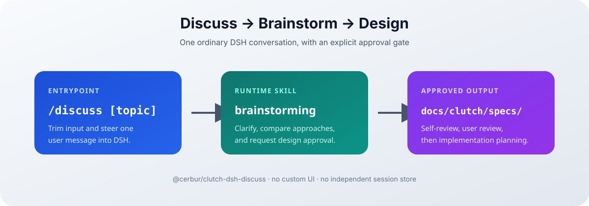

# @cerbur/clutch-dsh-discuss

## 功能介绍

`@cerbur/clutch-dsh-discuss` 为 DSH profile 增加一个小而确定的需求讨论入口。用户希望把
一个主题推进为经过确认的 design doc 时，plugin 保留 DSH 对话上下文，只转入已批准的
brainstorming 流程。



plugin 不提供自定义 UI、session store 或持久化层。运行时只有一个 bundled skill 和一个
人类命令，因此仍由 DSH 的普通对话和 plugin precedence 规则负责组合与覆盖。

## 能力

- 注册同时允许模型调用和用户调用的 `brainstorming` skill。
- 随 package 打包 brainstorming 指令、visual companion 和 spec reviewer 资源。
- 注册带可选主题的 `/discuss [topic]` 人类命令，并设置 `recordInput: false`，避免命令输入在
  conversation log 中重复记录。
- 将 `/discuss` 转为 `/brainstorming`，将 `/discuss <topic>` 转为一条包含
  `/brainstorming`、空行和 trim 后主题的 user message。
- 将批准后的 design doc 目标固定为
  `docs/clutch/specs/YYYY-MM-DD-<topic>-design.md`。
- 当 receiving agent 无法接受 steer message 时返回明确的命令错误。

package version 的唯一 source of truth 是 `package.json`；README 和安装命令不重复写版本号。

## 安装

### 从 npm 安装

在已安装 DSH CLI 的环境中，将 plugin 安装到实际启动 Web UI 的 profile：

```bash
dsh plugin --profile web add @cerbur/clutch-dsh-discuss
dsh web
```

如果使用 DeepSeek Harness 源码 checkout 且没有独立的 `dsh` 命令，可使用等价的 `pnpm dsh`
形式。

### 从仓库源码安装

先在 `clutch-dsh` checkout 中构建 package，再把绝对路径加入 DSH profile：

```bash
cd /path/to/clutch-dsh
pnpm install
pnpm --filter @cerbur/clutch-dsh-discuss build

cd /path/to/deepseek-harness
pnpm dsh plugin --profile web add /absolute/path/to/clutch-dsh/packages/clutch-dsh-discuss
pnpm dsh web
```

目标 profile 必须已经提供 DSH command 和 skill service。package 将这些 DSH package 声明为
peer dependencies，不会把它们复制为 runtime dependencies。

## 详细使用

安装后，在 DSH conversation 中执行：

```text
/discuss
```

这会在没有主题的情况下开始 brainstorming 流程。也可以在命令后提供普通文本作为起点：

```text
/discuss 为受邀请用户设计一个登录流程
```

plugin 会 trim 输入，并将 brainstorming gesture 作为一条 user message 发送。随后 skill 要求
依次完成项目上下文探索、澄清、方案比较、设计批准、spec 自审和用户复核，之后才能进入实现
计划。bundled resource directory 中包含该流程使用的 visual companion 和 spec reviewer 模板。


命令本身不会创建独立 session，也不会写文件。用户批准设计后，skill 规定的文档目标是
`docs/clutch/specs/`；后续计划或实现仍然是普通 DSH workflow。
