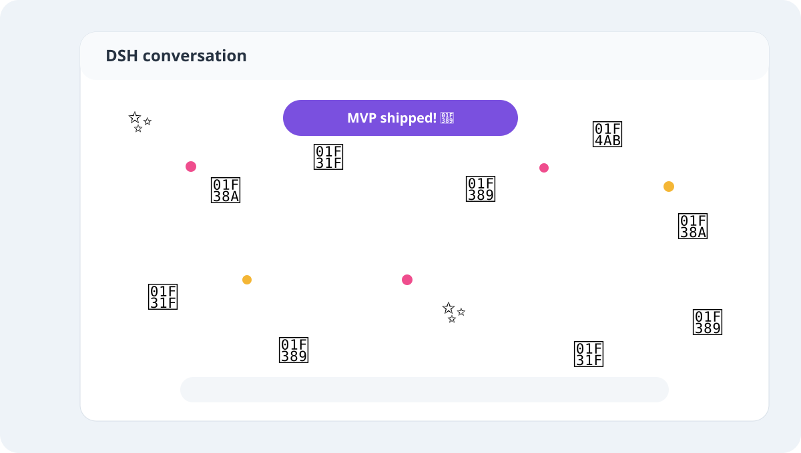
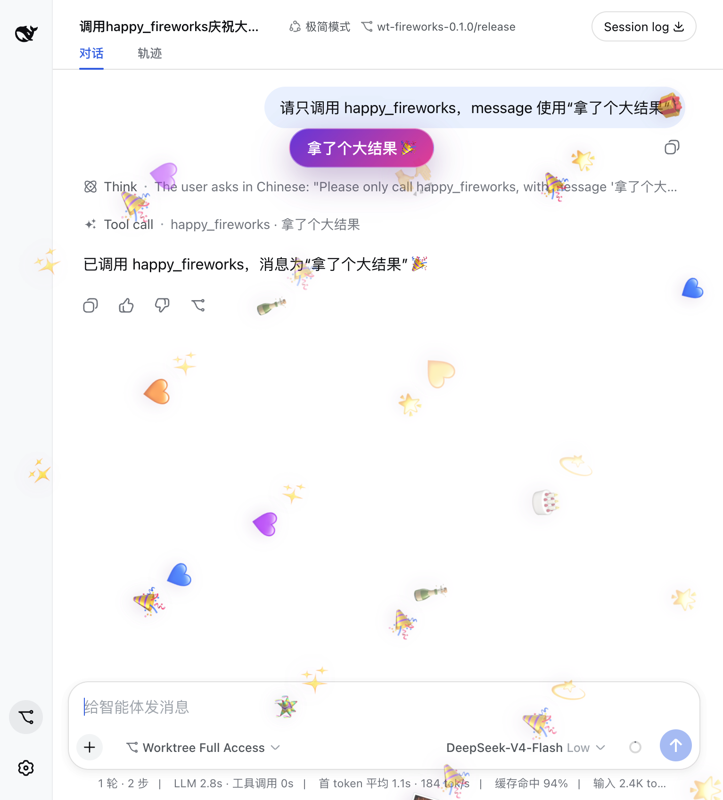

# @cerbur/clutch-dsh-fireworks

## Overview

`@cerbur/clutch-dsh-fireworks` adds a small celebration layer to the DSH Web UI. When an
agent completes a meaningful milestone and calls `happy_fireworks`, the selected conversation
gets a short burst of emoji fireworks.



This is a plugin-only extension. It uses DSH's existing tool-result, session-projection, and
`shell.overlay` extension points and does not modify DSH source code.

## Capabilities

- Registers the `happy_fireworks` agent tool.
- Accepts no required arguments and an optional short `message` for the celebration banner.
- Optionally injects a system prompt guidance section (`tool:fireworks`, order 2950) via `ctx.inject(['systemPrompt'])` when the host provides the `systemPrompt` service, providing concluding-turn decision guidance; degrades gracefully when absent.
- Documents explicit milestone triggers to encourage autonomous agent celebration:
  1. Finishing the design or specification of a document or plan;
  2. Completing the implementation and verification of a feature;
  3. Resolving and verifying a complex bug;
  4. Passing the entire test suite after a refactor or migration.
- Enforces an explicit negative boundary against invoking the tool for trivial routine steps (such as reading a file, inspecting git status, or running an isolated check).
- Plays only after a successful tool result or programmatic tool call dispatch (`tool/code-dispatch`); failures and cancellations stay quiet.
- Renders a click-through full-screen overlay with 40 emoji visuals per burst, including at least
  10 🎉, 5 🌟, and 5 ✨; the remaining 20 visuals use a seeded roll from an expanded celebration
  palette.
- Keeps historical replay and session switching from replaying an old burst.
- Exposes typed `emoji` and `svg` visual variants through `FireworksRenderer` for a future SVG renderer.
- Requires no DSH source patch; the package contributes only its own Cordis bundle and Web client metadata.

## Installation

### Install from npm (recommended)

With an installed DSH CLI:

```bash
dsh plugin --profile web add @cerbur/clutch-dsh-fireworks
dsh web
```

### Install from a repository checkout

Build the plugin, then install its absolute path into the DSH Web profile:

```bash
cd /absolute/path/to/clutch-dsh
pnpm install
pnpm --filter @cerbur/clutch-dsh-fireworks build

cd /absolute/path/to/deepseek-harness
pnpm install
pnpm run build
pnpm dsh plugin --profile web add /absolute/path/to/clutch-dsh/packages/clutch-dsh-fireworks
pnpm dsh web
```

The DSH Web profile and its native UI must already start successfully. Re-run the source install
command after changing the package manifest or `cordis.patch.yml`.

The documented source-install flow builds the local checkout explicitly. Generated `lib/` is not
committed, so use that local checkout flow instead of installing the package directly from a raw
`github:` package path.

## Usage

### Autonomous Milestone Celebration

With the concrete tool description and the injected system prompt guidance section (`tool:fireworks`), agents are guided to autonomously invoke `happy_fireworks` upon reaching major milestones in concluding turns—such as completing an architecture design, delivering and verifying a feature, fixing a complex bug, or passing full verification after a refactor. Agents are explicitly instructed to avoid invoking it for trivial intermediate steps.

### Manual / Prompt-Based Testing

You can also explicitly instruct an agent in the prompt to trigger the celebration for testing:

```text
After a meaningful milestone, call happy_fireworks with:
{"message":"The fireworks MVP is ready to test!"}
```

The tool result appears in the conversation, and the visual layer appears over the currently
selected session for a few seconds:


The same successful tool call in the DSH Web UI looks like this:



The first signal already present when a session is opened is intentionally silent, so a refresh
does not replay old celebrations. Celebrations trigger on both direct top-level tool results and
programmatic tool calling (`run_code`) dispatches.

To remove the plugin from a profile:

```bash
pnpm dsh plugin --profile web remove @cerbur/clutch-dsh-fireworks
```
