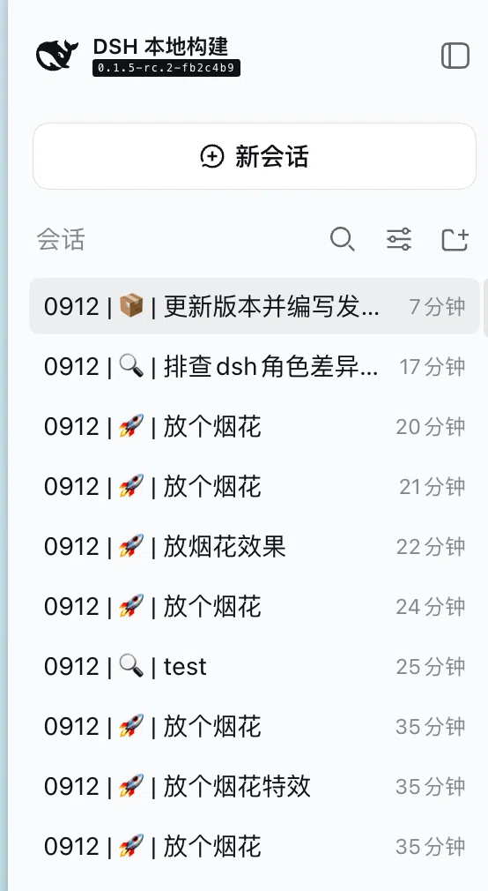
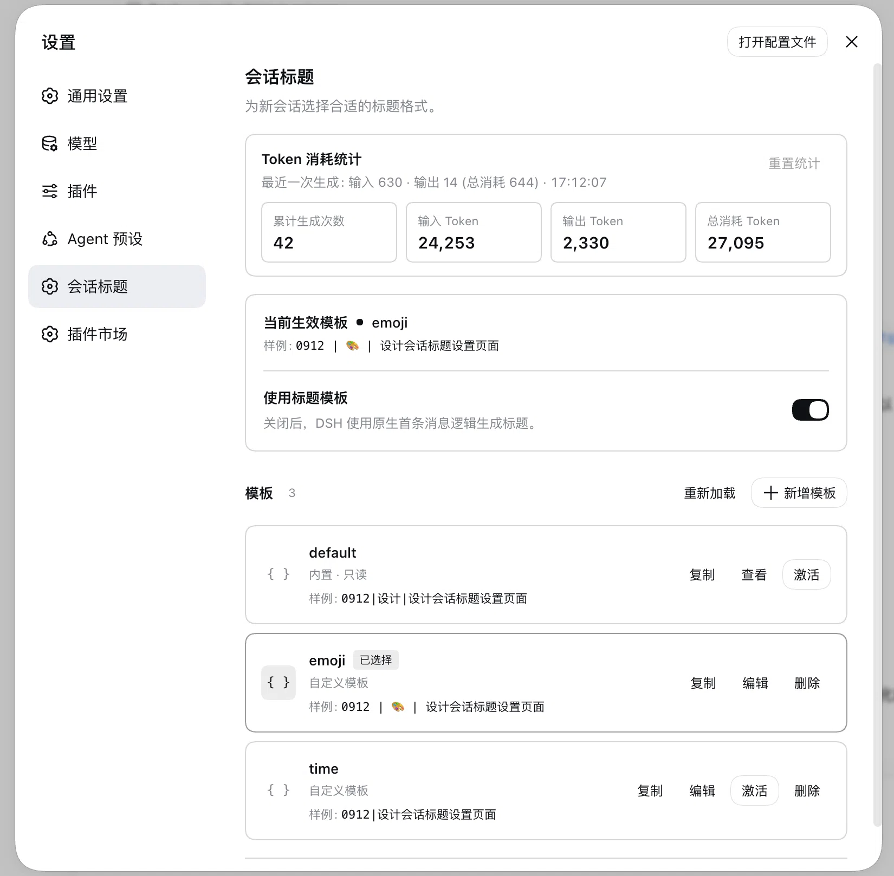

[English](README.md) | [简体中文](README.zh.md)

# @cerbur/clutch-dsh-title

@cerbur/clutch-dsh-title gives new DSH Sessions configurable, scannable titles. In DSH Web,
open Settings → Session Title to choose a built-in or saved template, or create your own.

A title can combine the session date, fixed text, a controlled category, and a short description
of the first prompt, for example 0912 | 🚀 | add token statistics. The result stays in DSH's
native Session list; this package adds the title provider and settings manager without replacing
that list.

## Installation

### Install from npm

With an installed DSH CLI, add the package to the Web profile and start DSH Web:

```bash
dsh plugin --profile web add @cerbur/clutch-dsh-title
dsh web
```

When using a DeepSeek Harness source checkout without a standalone dsh command, use the equivalent
pnpm dsh form.

### Install from a local checkout

The package's lib/ directory is generated and is not committed. Build both this workspace package
and the DSH source checkout, then add the package by absolute path:

```bash
cd /absolute/path/to/clutch-dsh
pnpm install
pnpm --filter @cerbur/clutch-dsh-title build

cd /absolute/path/to/deepseek-harness
pnpm install
pnpm run build
pnpm dsh plugin --profile web add /absolute/path/to/clutch-dsh/packages/clutch-dsh-title
pnpm dsh web
```

After changing source files, package metadata, or cordis.patch.yml, rebuild the package and repeat
the absolute-path add command.

## Features

| Feature                     | Preview                                                                                                                      | What it does                                                                                                                                                                                                 |
| --------------------------- | ---------------------------------------------------------------------------------------------------------------------------- | ------------------------------------------------------------------------------------------------------------------------------------------------------------------------------------------------------------ |
| Native Session titles       |  | The selected template automatically composes a compact title from date, category, fixed text, and first-prompt summary. Titles remain in DSH's native Session list; the plugin does not take over that list. |
| Template manager            |            | Settings → Session Title supports preview, duplicate, edit, save, activate, and delete. The same page enables or disables custom title generation.                                                           |
| Flexible template fields    | —                                                                                                                            | datetime and literal fields resolve deterministically without a model. llm-enum and llm-text fields are model-backed; referenced LLM fields are extracted in one structured request.                         |
| Generation statistics       | —                                                                                                                            | Count successful model calls and failed calls that consumed tokens; view cumulative input/output/total tokens and the latest model-call details. Reset the stored statistics after confirmation.             |
| Output repair and error log | —                                                                                                                            | Expand Retry settings below token statistics to choose 0–3 extra calls and view the error log for counters, last successful repair time, the latest 10 incidents, and confirmed reset.                       |

## Usage

### Choose a title template

1. Start DSH Web with dsh web.
2. Open Settings → Session Title.
3. Keep Use title templates enabled, choose a row, and select Activate.
4. Create a new Session, or use DSH's native title refresh action for an existing Session.

The read-only default template is selected in a fresh settings file. A newly selected format does
not rewrite existing titles until DSH explicitly generates or refreshes one.

### Manage templates

Fresh settings include an editable emoji template with a description limit of 64 Unicode characters
while the built-in default template remains selected. The emoji template can be edited or deleted;
deleting it does not recreate it on a later settings registration.

- Duplicate any row, including default, to open an editable copy.
- Give a copy a unique name, edit its YAML, and select Save. Saving does not activate it.
- Select Activate when a saved template should become effective.
- View or select default, but do not edit or delete it.
- Deleting the active custom template selects default.
- Each row shows an illustrative example while editing. Examples do not call a model.

### Create a custom template

The editor accepts a template and optional fields. A template reference such as
${daytime} is resolved from fields.daytime, and ${desc} is resolved from fields.desc:

Each ${fieldName} reference is resolved by fields.<fieldName>; it is a field substitution, not
an instruction or expression.

```yaml
template: '${daytime} | ${desc}'
fields:
  daytime:
    kind: datetime
    source: session.createdAt
    format: MMDD
    timezone: Asia/Shanghai
  desc:
    kind: llm-text
    instruction: Summarize the first prompt in a few words
    maxCharacters: 32
```

Use datetime or literal for deterministic values. Use llm-enum for a controlled model-selected
value, or llm-text for a short model-generated value. Saving validates the YAML and field
definitions before the template can be activated.

### Refresh / regenerate a title

Use DSH's native Session title refresh action to explicitly run the current provider again. The
refresh uses the current template and the Session's original createdAt value, so a datetime field
does not change merely because the title was refreshed.

### Disable custom titles

Turn off Use title templates in Settings → Session Title. The package keeps the saved templates and
selection, but DSH resumes its native first-prompt title generator.

### View generation statistics

Open Settings → Session Title to see counted title-model calls, input tokens, output tokens,
total tokens, and the latest model-call details when the model reports them. Every successful model
call counts once, even with zero or missing usage. Failed calls count when they report positive token
consumption; only failed calls with zero or missing consumption are excluded. Repair calls follow
the same rule, so a consumed failed attempt followed by a successful repair counts twice. A success
with reported consumption is never counted twice. Tokens include reported consumption from all
calls. Deterministic-only templates do not add a generation statistic. Reset requires confirmation.

Reset is available after statistics are successfully read from the connected host, including
locally installed plugins. The token card and counters
inherit the settings panel background in both light and dark themes.

Existing statistics retain their historical count because the old data does not contain enough
information to reconstruct all past call outcomes and consumption. Reset statistics to start a
fresh count under this rule.

### Configure repair and inspect error logs

Within the Token usage card, expand Retry settings below the counters to access output repair and
error logs. This section starts collapsed. Use its dropdown to choose 0–3 extra model calls after
unusable output; 0 disables repair. Dividers separate the counters, retry section and error log.
The dropdown uses DSH's settings-selector background and highlights on hover or while open.
The choice is saved immediately through DSH settings and applies to future generation or refresh.
All calls share the title timeout; transport, cancellation and deadline failures are not retried.

The Error log is displayed directly when Retry settings is expanded. It shows cumulative incident, repair-call
and recovered counts, the last successful repair time, and a table of the latest 10 incidents,
newest first. Expand a row's response details for message seqs, rejection reasons and bounded raw
responses. Reload refreshes diagnostics. Reset diagnostics requires confirmation and resets the
entire error-log domain: incident, repair-attempt and recovered counts, the last repair time and
all incident records. Token statistics and templates are independent.

The clutch_title_diagnostics storage domain persists only the latest 10 incidents; a new incident
evicts the oldest without reducing cumulative counts. Legacy lastIncident data is imported on read
and replaced by recentIncidents on the next write. The titleStats remote namespace provides
getDiagnostics and resetDiagnostics; each incident also produces one warning. If diagnostics cannot
be read, the panel reports that failure and disables resetting until a read succeeds.
Reset results and errors remain available even if the subsequent settings refresh stalls.
Diagnostics refresh independently, so a slow or unavailable error log does not delay template
loading or saving the repair setting. A diagnostic write that succeeds after its timeout is
counted once; records arriving later and resets remain separate from that write.
Replacing the storage connection also preserves those completed writes and subsequent records.

## Template reference

Templates use simple field substitution:

| Field kind | Purpose                                             | Uses a model |
| ---------- | --------------------------------------------------- | ------------ |
| datetime   | Format the Session timestamp from session.createdAt | No           |
| literal    | Insert fixed text                                   | No           |
| llm-enum   | Select one of the declared controlled values        | Yes          |
| llm-text   | Generate a short text value                         | Yes          |

Use the placeholder form ${identifier}. The identifier must name a declared field. Placeholders
do not support functions, expressions, conditions, loops, or arbitrary code. Unknown fields,
malformed YAML, and invalid field definitions are rejected during validation.

## Configuration

Title settings remain keyed by the `clutch-dsh-title` DSH profile entry. DSH 0.1.6 and earlier store
the section in `$DSH_HOME/settings.yaml`. DSH `dsh-v0.1.7-rc.1` stores the same enabled, selected,
and template values as volatile fields in the active Web profile's `cordis.yml`; its one-time
settings importer moves an existing `$DSH_HOME/settings.yaml` section into the profile and renames
the old file to `settings.yaml.imported`.

DSH normally uses `~/.dsh` as `$DSH_HOME`, but the source of truth is version-dependent DSH profile
configuration, not a hard-coded home path. The package does not use browser storage or `clutch.yaml`.
External edits to the source-of-truth settings are picked up by DSH's reload path. Invalid template
entries remain visible in Settings so they can be repaired instead of silently disappearing.

Profile configuration and Settings → Session Title can set:

- repairAttempts: how many extra model calls one title generation may spend after the model returns
  unusable output. Defaults to 1; accepted values are 0 through 3, and larger values are rejected.
  These calls share the single timeoutMs budget and are never used for transport, cancellation, or
  deadline failures.

## Behavior and limitations

- Only the first eligible user prompt contributes to an automatic title. Later messages do not
  automatically replace it.
- A long first prompt is bounded by the configured input-byte budget while preserving its head and
  tail. The original Session message is not modified.
- A changed template affects future generation or an explicit refresh. Existing titles are not
  batch-rewritten.
- If the active template is missing or invalid, the settings manager uses the built-in default
  template.
- If field extraction, rendering, or custom title generation fails, DSH's normal first-prompt
  generator handles the title instead. That fallback is DSH's own truncation of the first prompt, so
  it does not follow the template.
- The model is asked for exactly one JSON object whose keys are the referenced LLM fields, one of
  the declared literal values for each enum field, and a literal shape example. When a response is
  still unusable, the package sends one bounded corrective turn that quotes the rejected response
  back verbatim and states the rejection reason, up to repairAttempts extra calls.
- Unusable output, including max-tokens truncation and unexpected tool-calls, is repaired within
  the configured budget. A transport error, a cancellation, or an exhausted deadline
  keeps its own error and falls back immediately; every attempt shares the one timeoutMs budget.
- Each incident is logged once with its provider, model, message seqs, rejection reason, and the raw
  response bounded to 2000 characters, and is persisted in the clutch_title_diagnostics storage
  domain (only the latest 10 incidents, at most four rejected responses per incident, and at most 64 incidents buffered in memory while
  storage is unavailable, including stalled opens or writes). Once that buffer is full, the oldest
  buffered incident is dropped. Persistence is best effort and never delays or fails a title.
- DSH remains responsible for title length limits, title persistence, manual rename pinning,
  refresh and unpin behavior, fork title-event inheritance, cancellation, and stale-result
  protection.
- The bundle patch disables DSH's default session-title-first-prompt-llm provider before inserting
  this provider. DSH permits only one session-title provider: do not re-enable the default or
  install another title provider in the same profile. A second registration is rejected by DSH's
  single-provider invariant.

## Requirements

- DSH peers: @deepseek-ai/dsh-settings, @deepseek-ai/dsh-storage-domain,
  @deepseek-ai/dsh-typert-protocol, @deepseek-ai/dsh-api-remotes, @deepseek-ai/dsh-client-locale,
  @deepseek-ai/dsh-client-ui-settings, @deepseek-ai/dsh-client-ui-slots,
  @deepseek-ai/dsh-client-ui-primitives, @deepseek-ai/dsh-llm, @deepseek-ai/dsh-session,
  @deepseek-ai/dsh-session-title, @deepseek-ai/dsh-session-title-llm, @deepseek-ai/dsh-timeout,
  and @deepseek-ai/dsh-util-values, all at >=0.1.7-rc.1.
- Cordis: @deepseek-ai/cordis ^4.0.1.
- Running DSH `dsh-v0.1.7-rc.1` requires Node.js `^22.19.0 || >=24.0.0`.
- Profile: a DSH Web profile that provides the session, session-title, LLM, settings, storage,
  remote, and browser settings services declared by the package.

### Compatibility

Cordis configuration using template and fields remains supported. When those values come from the
profile configuration, Settings exposes them as an editable legacy row. The current Settings template
manager and the legacy configuration use the same validation rules.

The plugin marks its extraction wrapper message with DSH's native `dsh-session-title-llm` message-source
kind to satisfy format v4 validation during session reload, while recording `clutch-dsh-title` as the title
provider. DSH 0.1.7 also replaces the old settings registration API with profile-backed volatile Config
fields; the same title editor uses those fields, and DSH imports existing legacy settings during profile migration.

Model routing and optional reasoning settings are profile-level configuration, not template field
settings. Keep the DSH default title provider disabled and do not compose a second title provider
with this package.

## Development

Build, type-check, and test the package from the workspace root:

```bash
pnpm --filter @cerbur/clutch-dsh-title typecheck
pnpm --filter @cerbur/clutch-dsh-title build
pnpm --filter @cerbur/clutch-dsh-title test
```

Package-specific release parameters and source-install constraints are documented in
[docs/RELEASING.md](docs/RELEASING.md). User-facing release history is in
[RELEASE-LOG.md](RELEASE-LOG.md).

## Uninstall

With the DSH CLI:

```bash
dsh plugin --profile web remove @cerbur/clutch-dsh-title
```

From a DeepSeek Harness source checkout, use pnpm dsh plugin --profile web remove with the same
package name.

## Friendly Links

- [LINUX DO](https://linux.do/) — A new ideal community.
