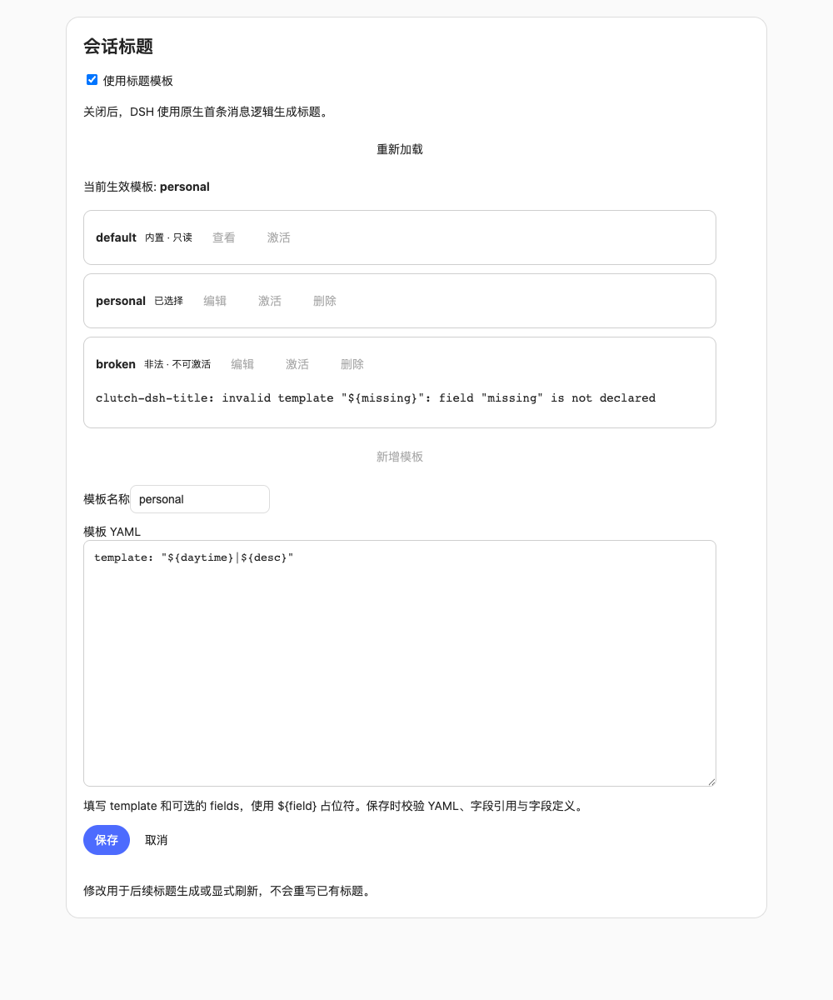

# @cerbur/clutch-dsh-title

## 功能介绍

`@cerbur/clutch-dsh-title` 通过 DSH 原生 `@deepseek-ai/dsh-session-title` seam 和 `ctx.sessionTitle` 替换默认的 `session-title-first-prompt-llm` provider。它只从首条 eligible prompt 提取语义字段，再根据经过校验的 template 以 deterministic 方式生成最终 title。


默认 title 形态是 `0904|功能|优化 session title 生成规则`：按 timezone 计算的 session 创建日期、LLM 选择的任务类型，以及对首次 prompt 的简短描述。

## 能力

- 提供不可修改的内置 `default` 模板，以及支持开放字段命名的用户模板。
- 新设置预置可编辑的 `emoji` 模板，支持复制任意模板，并在每行展示标题格式样例。
- **设置 → 会话标题** 支持新增、编辑、删除、激活模板，或关闭自定义以使用 DSH 原生首条消息标题生成。
- 数据实时存储于 `$DSH_HOME/settings.yaml`；非法模板保留展示，当前模板非法或缺失时降级到 `default`。
- field kind 固定为 `datetime`、`literal`、`llm-enum` 和 `llm-text`。
- 模板实际引用的 `llm-*` 字段去重后合并为一次 structured JSON LLM request；仅含 `datetime`、`literal` 或纯文本的模板不调用模型。
- 长首条消息在输入字节预算内保留首尾，并明确标记中段省略。
- template DSL 只支持 `${identifier}`；函数、路径、条件、表达式和代码执行都会被拒绝。
- 管理的模板非法时使用 `default`；extraction 失败、取消、超时、空输出、tool call 和非 stop finish 使用 DSH 原生 fallback。
- `maxTitleBytes`、persistence、rename pin、refresh、fork inheritance、取消和 stale-result protection 仍由 DSH 负责。
- 不批量迁移已有 session；新配置在 native service 执行 explicit refresh 时才影响重新生成。
- 本 plugin 只注册一个 native session-title provider；同一 context 不要重新启用默认 provider，也不要安装另一个 title provider。

## 安装

### npm registry

安装 package 并将它加入 DSH web profile：

```bash
npm install @cerbur/clutch-dsh-title
dsh plugin --profile web add @cerbur/clutch-dsh-title
```

package 需要 DSH runtime peer `>=0.1.2-rc.1`，包括 `@deepseek-ai/dsh-session-title`、`@deepseek-ai/dsh-session-title-llm`、`@deepseek-ai/dsh-llm` 和 `@deepseek-ai/dsh-session`。

### 源码 checkout

在本地 `clutch-dsh` checkout 中安装 workspace 依赖，然后加入 plugin 目录：

```bash
pnpm install
dsh plugin --profile web add /absolute/path/to/clutch-dsh/packages/clutch-dsh-title
```

package 包含 Host 和 browser 入口，通过 `cordis.patch.yml` 和 DSH client loader 挂载。设置页面依赖原生 settings、settings UI、locale 和 API remotes；没有 settings 的 Host-only 组合保留 Cordis 配置行为。

## 详细使用

### 模板管理

新设置会预置可编辑的 `emoji` 模板：格式为 `MMDD | 🎨 | 描述`，任务类型取值为 🎨 / 🔍 / 🚀 / 🔧 / ♻️ / 📦，并设置 `desc.maxCharacters: 1024`。默认仍选中 `default`。预置模板作为继承配置提供，保存模板改动后写入 `$DSH_HOME/settings.yaml`；已有模板映射或旧 Cordis 模板会保留。可以编辑或删除 `emoji`，删除后不会重新出现。

点击任意模板行（包括 `default`）的**复制**，会打开包含该行 YAML 的新草稿。填写唯一名称后保存；保存不会自动激活副本。非法模板也可复制后修复，但必须通过校验才能保存。

每行新增**样例**标题，编辑时同步更新。样例使用当前日期及模板时区、literal 值、枚举首个候选项和受 `maxCharacters` 限制的示例文本，不调用模型；真实语义字段与 DSH 最终字节上限可能使实际标题不同。非法 YAML 会显示无法展示。

打开 **设置 → 会话标题**。**新增模板** 会复制 `default`；填写唯一名称、编辑 YAML，然后 **保存**、**激活**。保存新模板不会自动激活。`default` 可以查看和选择，但不能编辑或删除。删除已选择的模板会选择 `default`。关闭 **使用标题模板** 后保留模板及选择，并调用 DSH 原生首条消息 LLM 标题生成器。



模板以紧凑列表展示状态和操作，点击编辑或查看即可就地展开编辑器。
面板跟随 DSH 浅色/深色主题，并适配窄屏。编辑器打开期间会锁定生成开关，
避免切换开关导致自己的草稿版本过期。

多行编辑器仅接受 `template` 和可选的 `fields`，不填写 `preset`。保存校验 YAML 语法、重复键、`${identifier}` 引用、字段类型、日期/时区格式和枚举/文本约束。名称为 1–64 个字母、数字、空格、下划线或连字符，以字母或数字开头。`default`、`constructor`、`prototype`、`__proto__` 为保留名称。模板文本最多 65536 个字符。字段按名称继承内置字段，覆盖时替换整个定义。

唯一数据源是 `$DSH_HOME/settings.yaml`（通常为 `~/.dsh/settings.yaml`，或 DSH settings provider 配置的文件）中的 `clutch-dsh-title` 命名空间，不使用 browser storage 或 `clutch.yaml`：

```yaml
clutch-dsh-title:
  enabled: true
  active: personal
  templates:
    personal: |
      template: '${daytime}|${desc}'
```

DSH watcher 接收外部编辑。非法模板保留展示错误、禁止激活。当前选择非法或缺失时使用 `default`；修复并保存后恢复该选择。外部 `default` 覆盖被忽略。容器配置非法时展示诊断并使用安全默认值。整个 YAML 文档损坏时，DSH 在热更新中保留最后可读取的文档。

页面发送写入前执行校验；存储 schema 有意接受外部非法条目，使其仍可修复。运行时生成再次校验。写入保留其他条目并携带 `expectedRevision`；过期保存返回 `settings/conflict`。收到外部更新后保留草稿并要求重新打开编辑器。DSH 在文件 watcher 接收外部编辑前存在竞态窗口，请避免同时手工编辑文件与页面保存。只读 settings 禁用写入。

### 既有 Cordis 配置

bundle patch 会按精确的 id/name 禁用名为 `@deepseek-ai/dsh-session-title-first-prompt-llm` 的 DSH entry，再插入 `preset: default` 的本 plugin。title subsystem 仍只有 native service。

既有 Cordis 覆盖继续支持。组合 settings 时，显式 `template`/`fields` 覆盖成为继承的可编辑 `legacy` 模板，不会修改 `default`。存储的 templates 映射替换继承的映射。模型路由和请求预算仍使用 Cordis 配置。默认 Cordis 配置如下：

```yaml
preset: default

template: '${daytime}|${type}|${desc}'

fields:
  daytime:
    kind: datetime
    source: session.createdAt
    format: MMDD
    timezone: Asia/Shanghai

  type:
    kind: llm-enum
    instruction: 判断这个 session 的任务类型
    values:
      - value: 设计
        description: 明确需求、制定实现方案，或设计架构、接口和交互时使用
      - value: 探索
        description: 理解代码、调研技术、分析问题或验证可行性，主要目标是获得结论时使用
      - value: 功能
        description: 新增此前不存在的能力，或扩展现有功能的使用场景时使用
      - value: 修复
        description: 纠正缺陷、排查并解决故障，或恢复预期行为时使用
      - value: 优化
        description: 在保持现有功能含义的基础上，改善性能、体验、结构或可维护性时使用
      - value: 发布
        description: 准备版本、编写发布说明、打包、部署或执行上线流程时使用

  desc:
    kind: llm-text
    instruction: 总结首次 prompt，保留具体任务含义
    maxCharacters: 32
```

field definition 按 field name 合并，但每次覆盖会替换整个 field definition。例如可以使用任意 field name 和受控的 values：

`llm-enum.values` 中每项可以是字符串，也可以是包含非空 `value` 和 `description` 的对象，两种写法可以混用。`description` 告诉模型何时选择该值，标题只输出 `value`。规范化后的值不能重复。非法项会阻止保存和激活；从磁盘读取的当前模板非法时回退到 `default`。

```yaml
preset: default
template: '${daytime}|${kind}|${desc}'
fields:
  kind:
    kind: llm-enum
    instruction: 判断任务是优化、功能还是修复
    values:
      - value: 优化
        description: 改进已有功能的性能、体验或结构时使用
      - value: 功能
        description: 新增此前不存在的能力时使用
      - value: 修复
        description: 纠正错误或恢复预期行为时使用
  desc:
    kind: llm-text
    instruction: 总结首次 prompt
    maxCharacters: 32
```

只解析 compiled template 实际引用的字段。同一字段重复引用时只提取一次，所有被引用的 LLM 字段合并为一次 JSON-framed request。例如 `${daytime}|${desc}|${desc}` 只请求 `desc`，不要求模型返回继承的 `type`。`${daytime}` 或仅含 literal 的模板不调用模型，也不写入 `session/title-llm-request` event。所有字段定义（包括未使用和继承的字段）仍执行配置合法性校验。

模型只返回字段；renderer 负责插入 deterministic 值和 literal separator。renderer 不执行 template 内容，field validation 会在渲染前 trim、清理控制字符，并校验 enum membership 或 Unicode character limit。

### 标题思考强度

Cordis `reasoningEffort` 默认为 `off`。除简洁 JSON prompt 外，插件会通过 `GenerateOptions.reasoningEffort` 将这个适配器定义的 ID 传给模板字段提取请求。可设置为所选 provider/model 支持的其他非空 ID，或显式设置 `reasoningEffort: null` 以省略该参数、使用适配器默认值。这是插件级 Cordis 配置，不属于模板 YAML，也不在模板管理器中设置；切换模板后仍然生效。

实际思考行为取决于 DSH 适配器与模型。特别是 pi-ai 可能通过省略 reasoning 参数实现 `off`，因此不能保证上游模型停止思考。不支持的强度可能以 `UNSUPPORTED_REASONING_EFFORT` 失败并进入原生标题 fallback；插件不会换用其他强度重试。该配置仅在启用标题模板时生效，不修改主会话请求或关闭模板时使用的原生生成器。原生 `session/title-llm-request` 事件 schema 保持不变，不记录思考强度。

### 长首条消息与输入预算

Cordis `maxInputBytes` 默认为 `4096`，约束实际发送给模型的完整 JSON-framed user input，包括 framing 指令、`seq`、JSON 转义和裁剪元数据；不包括独立的 system 指令和模型传输封装。短输入的原有 framing 和文本保持不变。

输入超限时，plugin 去掉外部空白，保留首条 eligible prompt 的首尾。预留 framing 和标记开销后，按 JSON 转义后的 UTF-8 bytes 将剩余预算尽量均分给首尾，并将余量用于另一端。序列化的消息条目带有 `truncated: true`，省略的中段替换为 `\n[...middle omitted...]\n`。裁剪保留完整 Unicode 码点（包括代理对），但可能拆开组合 emoji 或其他字素簇。最后再次校验完整输入不超过字节上限。

首尾保留兼顾开头背景和末尾要求；中段细节会丢失，标题准确性可能下降。不进行模型摘要、不增加模型调用，也不读取后续对话。首尾各需保留至少一个非空白的原文码点；预算不足以容纳这种有效标记输入时，抛出 `maxInputBytes` 错误并使用原生 fallback。

`session/title-llm-request` event 记录实际发送给模型的完整裁剪后 payload；`messageSeqs` 保留原始来源序号。原始 session 消息不会被修改。DSH 原生自动调度仍会等待 request header，确定性模板也遵循该规则；显式 refresh 可在没有模型路由时渲染这种模板。

如果 extraction 失败，provider 会抛错，由 `ctx.sessionTitle` 使用 DSH 原生 fallback。native `rename()` 仍会 pin 用户 title，后续自动生成不能覆盖；native `refresh()` 仍是显式重新推导操作。title 和 `session/title-llm-request` event 使用 DSH persistence，并由 native fork 继承。配置变化不会重写历史 title event，也不会触发批量 rename。

同一 context 只能注册一个 provider。启用本 package 时请保持默认 provider disabled，也不要和另一个同样注册 `ctx.sessionTitle` 的 provider 组合。

package-specific release 参数见 [`docs/RELEASING.md`](docs/RELEASING.md)，公开 release history 见 [`RELEASE-LOG.md`](RELEASE-LOG.md)。
