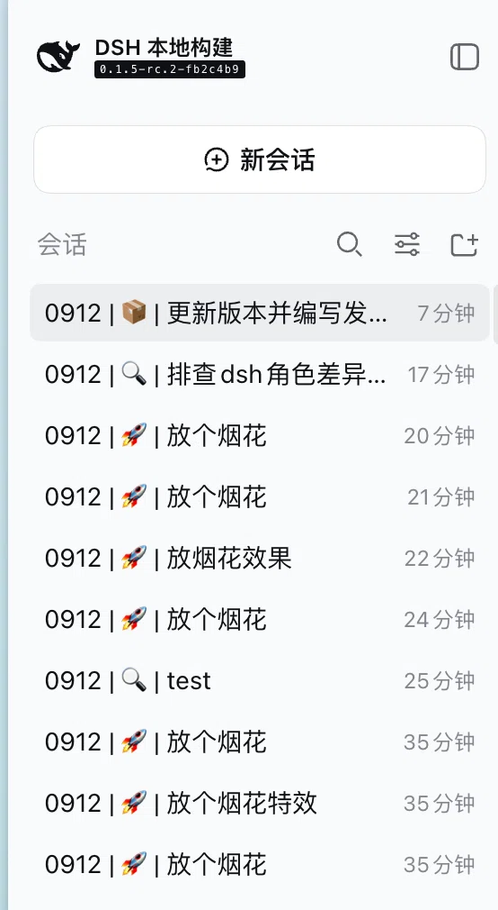
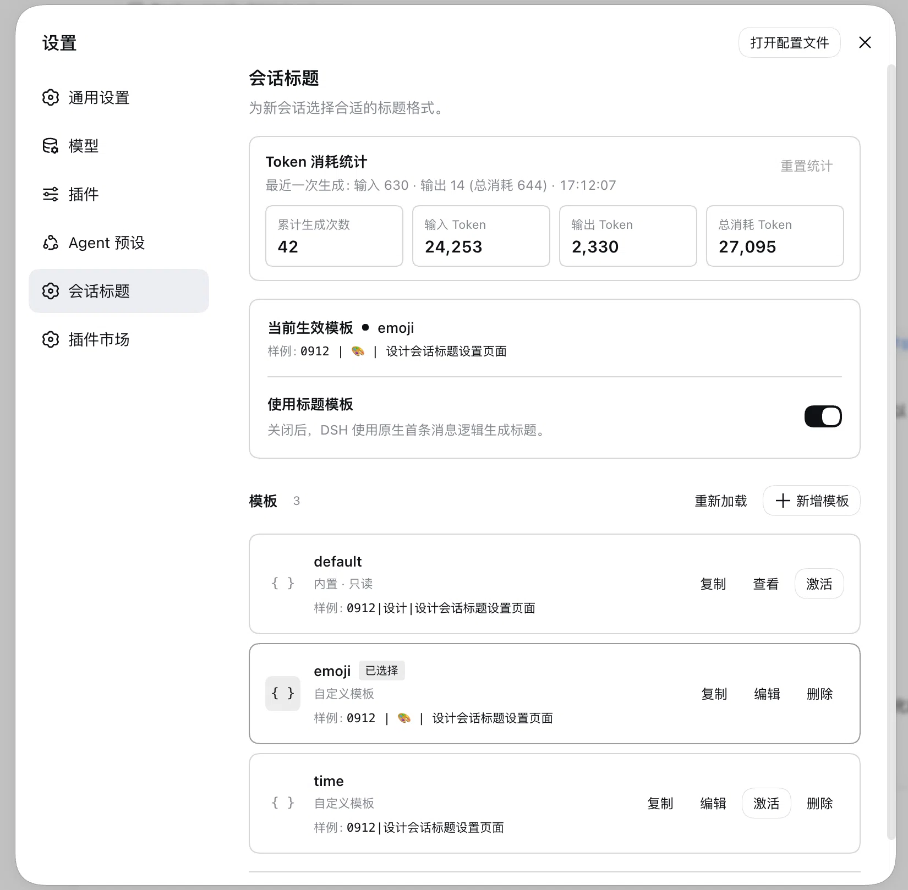

# @cerbur/clutch-dsh-title

## 功能介绍

为新的 DSH 会话自动生成简洁、易读的标题。在 **设置 → 会话标题** 中选择现成样式，或创建自己的格式。标题可以组合会话日期、emoji 或分类、固定文字，以及对首条 prompt 的简短描述，结果会直接显示在 DSH 原生会话列表中，方便快速浏览。



例如，标题可以是 `0912 | 🚀 | add token statistics`。激活前可以先预览样式，也可以随时切回 DSH 自带的标题生成方式。

## 能力

- 使用内置的 `default` 样式，或为不同类型的工作创建命名模板。
- 新设置会提供可编辑的 `emoji` 模板。
- 在模板行中预览标题样例，并复制、编辑、保存、激活或删除模板。
- 用日期、固定文字、受控分类或首条 prompt 的简短描述组合标题。
- 通过一个开关启用或关闭标题模板；关闭后恢复 DSH 自带的首条 prompt 标题生成。
- 在设置中查看标题生成的 Token 用量和最近一次生成明细，并支持重置统计。
- 非法模板会保留以便修复；标题无法生成时会安全回退。
- 已有标题不会自动改变，只有显式刷新后才会重新生成；插件不会批量改写历史 session。

## 安装

### npm registry

安装 package 并将它加入 DSH web profile：

```bash
npm install @cerbur/clutch-dsh-title
dsh plugin --profile web add @cerbur/clutch-dsh-title
```

需要 DSH `>=0.1.2-rc.1`。

### 源码 checkout

进行本地开发时，先安装 workspace 依赖，再加入 plugin 目录：

```bash
pnpm install
dsh plugin --profile web add /absolute/path/to/clutch-dsh/packages/clutch-dsh-title
```

## 详细使用

### 打开标题设置

1. 启动 DSH Web UI。
2. 打开 **设置 → 会话标题**。
3. 保持 **使用标题模板** 开启，选择一个模板并点击 **激活**。
4. 创建新的 session，在标题中查看所选格式。

页面会展示当前格式、实时样例、模板列表和标题生成 Token 用量：



### 选择和管理模板

新设置包含可编辑的 `emoji` 模板，使用日期、emoji 分类和描述。内置的 `default` 模板初始处于选中状态。可以编辑或删除 `emoji`；删除后不会自动重新出现。

- 点击任意模板行（包括 `default`）的**复制**，用相同格式开始新模板。
- 为副本填写唯一名称、编辑内容并点击**保存**。保存不会自动激活。
- 需要使用已保存的模板时，点击**激活**。
- 内置的 `default` 模板可以查看和选择，但不能编辑或删除。
- 删除当前激活的模板后会选择 `default`。
- 每行会展示编辑时实时更新的**样例**标题。样例不调用模型，因此实际标题可能不同。

### 创建自定义格式

编辑器接受 `template` 和可选的 `fields`，占位符只使用简单的 `${identifier}` 形式。例如：

```yaml
template: '${daytime} | ${desc}'
fields:
  daytime:
    kind: datetime
    source: session.createdAt
    format: MMDD
    timezone: Asia/Shanghai
  desc:
    kind: llm-text
    instruction: Summarize the first prompt in a few words
    maxCharacters: 32
```

`datetime` 用于会话日期，`literal` 用于固定文字，`llm-enum` 用于受控选项列表，`llm-text` 用于简短描述。保存前会校验占位符、日期、时区、枚举选项和文本长度。不支持函数、表达式、条件或代码执行。

保存的模板位于 `$DSH_HOME/settings.yaml`（通常为 `~/.dsh/settings.yaml`）的 `clutch-dsh-title` 部分。该文件是唯一数据源，不使用 browser storage 或 `clutch.yaml`。外部编辑会被 DSH 读取，非法条目会保留以便修复。

### 理解更新和回退

- 标题使用首条符合条件的用户 prompt，后续消息不会自动替换标题。
- 新保存的格式会在新生成或显式刷新时生效；已有 session 不会批量迁移。
- 当前模板非法或缺失时回退到 `default`；字段提取或标题生成失败时使用 DSH 原生标题生成器。
- 关闭 **使用标题模板** 会保留模板和选择，但改用 DSH 自带的首条 prompt 生成器。
- 首条 prompt 过长时，会在配置的输入预算内保留开头和结尾进行裁剪；不会使用后续对话生成标题。
- 标题长度限制、持久化、重命名固定、刷新和 fork 行为继续由 DSH 负责。

### Token 用量

设置页面提供标题生成的 Token 用量概览：

- **累计生成次数**统计带有有效用量数据的标题模型调用，包括 DSH fallback 调用。
- **输入、输出和总 Token**展示累计用量；如果可用，还会展示最近一次调用的缓存和思考明细。
- **重置统计**在确认后清空已保存的概览。

只使用日期或固定文字的确定性格式不会调用模型，也不会计入统计。

### 既有 Cordis 配置

如果 DSH profile 已经通过 Cordis 提供标题配置，原有的 `template` 和 `fields` 仍然有效。启用设置页面后，它们会作为可编辑的 legacy 模板出现。模型路由和可选的思考设置仍属于 profile 级配置，不是模板字段。

启用本 package 时请保持 DSH 默认标题 provider 关闭，也不要在同一 profile 中安装另一个 title provider。

package-specific release 参数见 [`docs/RELEASING.md`](docs/RELEASING.md)，公开 release history 见 [`RELEASE-LOG.md`](RELEASE-LOG.md)。

## 友情链接

- [LINUX DO](https://linux.do/) — 新的理想型社区
