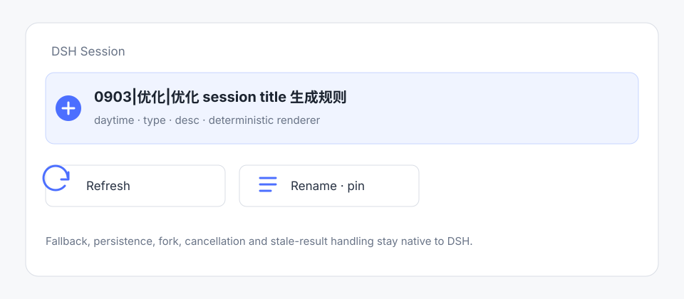

# @cerbur/clutch-dsh-title

## 功能介绍

`@cerbur/clutch-dsh-title` 通过 DSH 原生 `@deepseek-ai/dsh-session-title` seam 和 `ctx.sessionTitle` 替换默认的 `session-title-first-prompt-llm` provider。它只从首条 eligible prompt 提取语义字段，再根据经过校验的 template 以 deterministic 方式生成最终 title。



默认 title 形态是 `0904|配置|优化 session title 生成规则`：按 timezone 计算的 session 创建日期、LLM 选择的任务类型，以及对首次 prompt 的简短描述。

## 能力

- 提供一个内置 `default` preset，并支持覆盖 template 与开放命名的字段。
- field kind 固定为 `datetime`、`literal`、`llm-enum` 和 `llm-text`。
- 所有 `llm-*` 字段合并为一次 structured JSON LLM request；`datetime` 和 `literal` 字段不依赖模型输出。
- template DSL 只支持 `${identifier}`；函数、路径、条件、表达式和代码执行都会被拒绝。
- extraction 失败、配置非法、取消、超时、空输出、tool call 和非 stop finish 都会抛错并进入 DSH 原生 fallback。
- `maxTitleBytes`、persistence、rename pin、refresh、fork inheritance、取消和 stale-result protection 仍由 DSH 负责。
- 不批量迁移已有 session；新配置在 native service 执行 explicit refresh 时才影响重新生成。
- 本 plugin 只注册一个 native session-title provider；同一 context 不要重新启用默认 provider，也不要安装另一个 title provider。

## 安装

### npm registry

安装 package 并将它加入 DSH web profile：

```bash
npm install @cerbur/clutch-dsh-title
dsh plugin --profile web add @cerbur/clutch-dsh-title
```

package 需要 DSH runtime peer `>=0.1.2-rc.1`，包括 `@deepseek-ai/dsh-session-title`、`@deepseek-ai/dsh-session-title-llm`、`@deepseek-ai/dsh-llm` 和 `@deepseek-ai/dsh-session`。

### 源码 checkout

在本地 `clutch-dsh` checkout 中安装 workspace 依赖，然后加入 plugin 目录：

```bash
pnpm install
dsh plugin --profile web add /absolute/path/to/clutch-dsh/packages/clutch-dsh-title
```

package 是 host-only plugin，通过 `cordis.patch.yml` 挂载，不需要 browser bundle。

## 详细使用

bundle patch 会按精确的 id/name 禁用名为 `@deepseek-ai/dsh-session-title-first-prompt-llm` 的 DSH entry，再插入 `preset: default` 的本 plugin。title subsystem 仍只有 native service。

默认配置如下：

```yaml
preset: default

template: '${daytime}|${type}|${desc}'

fields:
  daytime:
    kind: datetime
    source: session.createdAt
    format: MMDD
    timezone: Asia/Shanghai

  type:
    kind: llm-enum
    instruction: 判断这个 session 的任务类型
    values: [前端, 后端, 配置, 文档]

  desc:
    kind: llm-text
    instruction: 总结首次 prompt，保留具体任务含义
    maxCharacters: 32
```

field definition 按 field name 合并，但每次覆盖会替换整个 field definition。例如可以使用任意 field name 和受控的 values：

```yaml
preset: default
template: '${daytime}|${kind}|${desc}'
fields:
  kind:
    kind: llm-enum
    instruction: 判断任务是优化、功能还是修复
    values: [优化, 功能, 修复]
  desc:
    kind: llm-text
    instruction: 总结首次 prompt
    maxCharacters: 32
```

所有 LLM field 会放进一次 JSON-framed request。模型只返回字段；renderer 负责插入 deterministic 值和 literal separator。renderer 不执行 template 内容，field validation 会在渲染前 trim、清理控制字符，并校验 enum membership 或 Unicode character limit。

如果 extraction 失败，provider 会抛错，由 `ctx.sessionTitle` 使用 DSH 原生 fallback。native `rename()` 仍会 pin 用户 title，后续自动生成不能覆盖；native `refresh()` 仍是显式重新推导操作。title 和 `session/title-llm-request` event 使用 DSH persistence，并由 native fork 继承。配置变化不会重写历史 title event，也不会触发批量 rename。

同一 context 只能注册一个 provider。启用本 package 时请保持默认 provider disabled，也不要和另一个同样注册 `ctx.sessionTitle` 的 provider 组合。

package-specific release 参数见 [`docs/RELEASING.md`](docs/RELEASING.md)，公开 release history 见 [`RELEASE-LOG.md`](RELEASE-LOG.md)。
