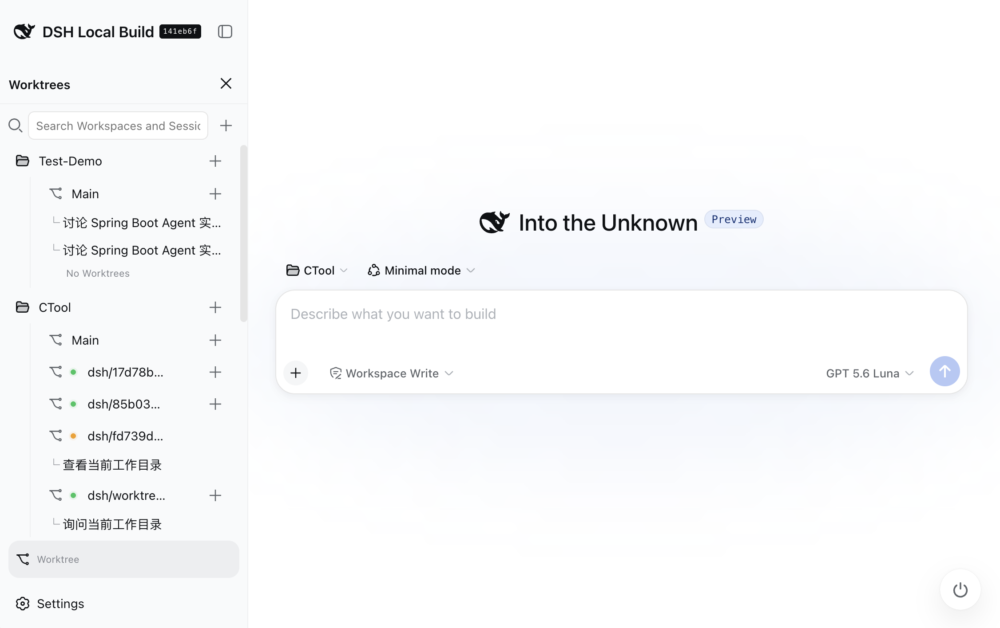

# @cerbur/clutch-dsh-worktree

`@cerbur/clutch-dsh-worktree` adds a Git Worktree view to the DSH Web UI. It groups
Sessions as Workspace → Worktree → Session while keeping DSH as the source of truth for
Project/Workspace identity, Session metadata, native lists, and conversation history.
The plugin stores only external Worktree/Session relationship metadata.

## Screenshots



The English screenshot shows Worktree mode in the Sidebar, a Workspace tree with Main and
Worktree rows, and the read-only blank-session Hero context.

## Capabilities

- Enter Worktree mode from the DSH Sidebar footer and browse Workspace → Worktree → Session.
- Search Workspaces and create a Git Worktree and branch from an existing local branch.
- Create a normal Session from Main or a Session whose runtime cwd is an active Worktree, then
  open it directly.
- See ready, repair, active, and detached Worktree states, including retryable operation errors.
- Remove an active Worktree from its options menu with confirmation. Main and detached rows do
  not expose that menu.
- Continue using DSH-native Workspace rename/delete/reorder and Session menus. Worktree rows can
  be reordered within their owning Workspace; order is stored in the plugin sidecar and Main is
  fixed first.
- Persist Workspace, Main, and Worktree expansion choices in browser-local storage; the five-row Session overflow state remains transient and resets after refresh or parent collapse.
- Keep the current local branch or Worktree branch visible as read-only context in the existing
  Conversation title row and in the blank-session Hero.
- Keep Conversation and Hero context stable across same-Session snapshot updates and Session
  switches, while retaining the last valid context during replacement reads.
- Truncate long branch labels to fit their chips and reveal the complete value through a native
  hover card; the Sidebar footer action follows native typography and does not add a duplicate
  `WT` button when the Sidebar is collapsed.
- Keep Worktree Sessions in the original DSH Project/Workspace view; the plugin does not copy
  Session content or modify messages, prompts, transcripts, or history.

### Compatibility and prerequisites

- For development and source validation, use a clean checkout of the official [DeepSeek Harness
  repository](https://github.com/deepseek-ai/deepseek-harness) on its current default branch. The
  repository currently uses `master` rather than `main`; it is developer-preview software, so its
  package and API contracts may change. Run the upstream install/build steps before installing
  this plugin into that profile.
- The target profile, such as `web` or `demo`, must already start successfully, and the plugin
  must be installed into the same profile that launches the Web UI.
- DSH Client must provide the native `@deepseek-ai/dsh-client-ui-conversation` package and its
  `conversation.session.header.actions` seat.
- Git must be installed and available on `PATH` for Worktree operations. A Workspace must be
  inside a Git repository with an initial commit and at least one local branch. A missing Git
  executable shows install guidance and no command block; a missing repository, initial commit,
  or local branch shows copyable setup commands. The plugin does not run setup or installation
  commands or modify Workspace files.
- The package declares an installable `dsh.bundle` and provides `cordis.patch.yml`; its browser
  UI is declared through the `dsh.client` metadata.

## Installation

Use the npm package for the normal user installation. Use a repository checkout to develop or
validate local source, or use the GitHub source path when installing the source package through a
marketplace entry.

### Install from npm (recommended)

With an installed DSH CLI:

```bash
dsh plugin --profile web add @cerbur/clutch-dsh-worktree
dsh web
```

When using a `deepseek-harness` source checkout without a standalone `dsh` command, use the
equivalent forwarding form:

```bash
cd /path/to/deepseek-harness
pnpm dsh plugin --profile web add @cerbur/clutch-dsh-worktree
pnpm dsh web
```

To inspect the currently published version on the official registry:

```bash
npm view @cerbur/clutch-dsh-worktree version --registry=https://registry.npmjs.org/
```

### Prepare the current upstream DSH checkout

For source-based development or validation, prepare the upstream checkout first. The current
upstream default branch is `master`; follow the repository's default branch if it changes later.

```bash
git clone https://github.com/deepseek-ai/deepseek-harness.git
cd deepseek-harness
git fetch origin
git pull --ff-only origin master
pnpm install
pnpm run build
```

### Install from a repository checkout

Build the package from the `clutch-dsh` checkout, then install its absolute path into the DSH
profile:

```bash
cd /path/to/clutch-dsh
pnpm install
pnpm --filter @cerbur/clutch-dsh-worktree build

cd /path/to/deepseek-harness
pnpm install
pnpm run build
pnpm dsh plugin --profile web add /path/to/clutch-dsh/packages/clutch-dsh-worktree
pnpm dsh web --dump-config
pnpm dsh web
```

The `--dump-config` output should include the plugin bundle layer. If the profile still contains
an old unscoped installation, remove it first:

```bash
pnpm dsh plugin --profile web remove clutch-dsh-worktree
```

To update a local checkout, rebuild the package and restart DSH:

```bash
cd /path/to/clutch-dsh
pnpm --filter @cerbur/clutch-dsh-worktree build
cd /path/to/deepseek-harness
pnpm dsh web
```

After changing `package.json`, `cordis.patch.yml`, or the profile bundle members, run the plugin
add command again.

### Install from GitHub source

The source path generated by `awesome-dsh-plugin` is:

```bash
dsh plugin --profile web add "github:Cerbur/clutch-dsh#path:/packages/clutch-dsh-worktree"
```

This is a source Git dependency, not a prebuilt npm package. Its `prepare` lifecycle generates
`lib/`. The current DSH profile uses pnpm 11 `allowBuilds`: on the first Git installation, pnpm
intentionally rejects the build and prints a complete key containing the package name, Git URL,
resolved commit, and subdirectory path. Copy that complete key into the profile's
`pnpm-workspace.yaml`, for example:

```yaml
allowBuilds:
  '@cerbur/clutch-dsh-worktree@git+https://github.com/Cerbur/clutch-dsh#<resolved-commit>&path:/packages/clutch-dsh-worktree': true
```

Use the exact package key printed by pnpm: `<resolved-commit>`, the Git URL, and the path must
match the error output. A package-name-only entry is not enough for a direct Git dependency, and
`onlyBuiltDependencies` is not the configuration used by the current pnpm 11 Git prepare flow.
After saving the allowlist, rerun the original install command. A new commit requires a new key.
The allowlist belongs to the profile owner who trusts that Git commit; do not add it to this
plugin package.

After authorization, Git prepare runs `pnpm install` in the checked-out monorepo and then
`pnpm run build`, so the profile must be able to reach its configured registry. Registry DNS,
mirror, or lockfile errors after authorization are installation-environment errors, not
`allowBuilds` rejections. Use the npm installation above to avoid source-build authorization.

### Uninstall

```bash
cd /path/to/deepseek-harness
pnpm dsh plugin --profile web remove @cerbur/clutch-dsh-worktree
```

## Usage

### Open Worktree mode

1. Start the DSH Web UI and select Worktree from the Sidebar footer. Worktree mode is an
   additive surface; it does not add a separate Workspace/Worktree tab.
2. Use the Workspace tree to search, expand, and select the Main or Worktree view. Each group
   initially shows five rows; use Expand more/Collapse for additional rows.


The screenshot above illustrates the Sidebar entry point and the visual context shown in the
blank-session Hero. The displayed language follows DSH's current language setting.

### Create a Worktree

1. Select a Workspace, press its `+`, choose a baseline local branch, and enter a Worktree name.
   The default branch name is `dsh/<8-character-random-string>`.
2. The target Worktree path must be absolute, belong to the same Project, and differ from the
   Project root. Relative paths, a different Project, or the Project root are rejected.
3. Git must be installed and available on `PATH`. A missing Git executable shows install guidance
   and no command block; install Git, restart DSH, and retry. If the repository, initial commit,
   or local branch is missing, follow the copyable setup commands in the dialog. The plugin only
   renders this guidance; it does not run setup or installation commands or edit business files.

### Create Main and Worktree Sessions

- Use Main's `+` to create a normal DSH Session in the Project-root view.
- Use a Worktree's `+` to create or reuse a Session with that Worktree as its runtime cwd. The
  plugin calls the upstream runtime with `session.create({ cwd: worktreePath })`, then saves the
  external binding, applies a browser-local `{ workspaceId, sessionId }` membership projection,
  and opens the Session.
- The connector reuses an unarchived blank Session with the exact target cwd when possible. An
  already-bound Session opens directly; an unbound candidate is bound before projection and
  opening. Otherwise the flow is `create → bind → project → open`, and concurrent clicks for the
  same Worktree are coalesced.
- If binding fails after DSH has created the Session, the Session ID remains available for Retry
  or Open recovery. The plugin does not delete or mutate that DSH Session.
- A provisional blank Session follows DSH's native display rules: it is shown only in the
  selected view, uses the localized `New Session` label, hides its generated ID, and has no
  Rename, Fork, or Archive menu. After the first prompt is accepted, it becomes an ordinary
  Session row; hiding the blank row does not delete the Session or its Worktree binding.

### Reorder and manage Worktrees

- Drag Worktrees within their owning Workspace. The ordered `worktrees` array is persisted in
  the plugin sidecar; Main is a fixed first row and Worktrees cannot move across Workspaces.
- Use the active Worktree options menu and confirmation dialog to remove a Worktree. Main and
  detached Worktrees do not show this menu.
- Removing a Worktree does not delete its Sessions. The relationship remains detached until it
  is explicitly unbound. Deleting a Workspace removes only DSH's Workspace registration; its
  directory, Sessions, Git Worktrees, and plugin sidecar remain.
- DSH-native Workspace rename/delete/reorder and Session menus remain available. Session drag
  ordering is limited to the current visual Main or Worktree group.
- The Main group shows the current local branch as `Local (branch)` and falls back to `Local` if
  DSH reports no current branch. When a Workspace is imported from a Git subdirectory, the Git
  root is resolved first and the same branch/worktree information is used as for the root.
  Branch names, paths, Workspace names, Session titles, and raw DSH/Git errors keep their
  original values.
- Existing Sessions show read-only context in the form `Session title` → `Agent mode` →
  `current branch / Worktree branch`. Long values remain ellipsized in the compact chip and show
  their complete value in a hover card. The blank Hero shows `Workspace (branch)` after the native
  title when its anchors are available and offers the same complete-value hover card.
- When the Sidebar is collapsed, the footer keeps its icon-only native action geometry; the plugin
  does not render a separate `WT` rail control.

### Understand status and recovery messages

- `ready` means the Worktree is available. `repair` identifies a missing or invalid Worktree,
  Session, binding, or cwd. `detached` means the Git Worktree was removed while the relationship
  was retained. An active binding pointing to a missing Worktree produces an explicit repair
  warning or error; it never silently falls back to another Worktree.
- Worktree health is a runtime Git projection and is not written to the sidecar. Git readiness
  failures are shown per Workspace: a missing Git executable shows installation guidance without
  commands, while repository, initial commit, or local branch failures show copyable setup
  commands. Connection, Gateway, and unexpected Worktree-domain failures remain visible as
  retryable errors rather than empty lists.
- Refreshing an already-ready view preserves its current projection until replacement data is
  available. Same-Session snapshot updates do not blank the context or trigger redundant reads;
  initial entry and explicit Retry may show a loading state when no cached view is available.

## Language behavior

Worktree mode follows DSH's current interface language. DSH owns the language preference; the
plugin does not add an independent language setting. The Worktree entry point, Workspace →
Worktree → Session tree, menus, dialogs, statuses, and retry messages are localized in English
and Chinese.

Workspace names, Session titles, branch names, paths, and raw DSH/Host error messages remain
unchanged for diagnosis and continued use of native DSH data. The Main group is localized as
`Local (branch)` in English and `本地（branch）` in Chinese, with `Local`/`本地` as the fallback
when no current branch is reported.

## Data boundaries and current limitations

DSH owns the original Project/Workspace identity and root, Session identity and metadata, native
Project/Session lists, messages, prompts, transcripts, and history. The plugin does not copy or
rewrite any of those values. Its external index lives in the DSH host's plugin data directory or
an independent sidecar store and may contain only relationship facts such as:

- `projectId`, `worktreeId`, and `sessionId`;
- an absolute Worktree path, branch, and lifecycle state;
- binding status and schema version.

The index is not written into a Project working tree or DSH's raw data directory. It does not
store a copy of `projectRoot` or any Session content. If the sidecar is unavailable or corrupt,
the native Project/Session view remains readable and the plugin becomes degraded/read-only; an
empty index must never overwrite the native DSH lists.

Each Session has at most one active Worktree binding, while a Worktree may have multiple bound
Sessions. Rebinding the same Session to the same Worktree is idempotent; binding it to two active
Worktrees is a conflict. A Session with no binding, a Main binding, or a detached binding runs
with the Project root as cwd. An active Worktree binding runs with that Worktree path. The cwd is
derived for each execution and is never persisted back into DSH Session metadata.

Worktree creation creates the Git Worktree before recording its external relationship. If the
sidecar write fails, the new Git Worktree is cleaned up when possible. A failed Worktree deletion
does not change the sidecar state, so the relationship remains retryable. Session creation uses
the native DSH API before binding; a binding failure never deletes or modifies the already-created
Session.

The Worktree session flow sends the independent Worktree cwd through the upstream DSH runtime and
keeps `{ workspaceId, sessionId }` as a browser-local membership projection rather than a
persistent DSH attach. It does not modify DSH source, Session metadata, or native Workspace
storage. The projection is replayed after native list refreshes and removed when the binding
disappears or the Client is disposed.

The blank Hero context is visual only. Because the current upstream DSH source checkout has no
additive Hero headline slot, its placement depends on the native `[data-phase="hero"]` and title
anchors; it disappears when those anchors are unavailable and should move to a formal DSH slot
when one exists.

## Development and verification

From the workspace root:

```bash
cd /path/to/clutch-dsh
pnpm install
pnpm run check:workspace
pnpm run check:patches
pnpm --filter @cerbur/clutch-dsh-worktree typecheck
pnpm --filter @cerbur/clutch-dsh-worktree build
pnpm --filter @cerbur/clutch-dsh-worktree test
```

For the bilingual README contract and formatting:

```bash
cd /path/to/clutch-dsh/packages/clutch-dsh-worktree
node --test test/readme-parity.test.mjs
pnpm exec prettier --check README.md README.zh.md test/readme-parity.test.mjs
```

The full workspace check is:

```bash
cd /path/to/clutch-dsh
pnpm run check
```

Do not commit generated `lib/`, coverage, sidecar data, or local credentials. See [AGENTS.md](AGENTS.md)
for package data boundaries and lifecycle rules, [docs/RELEASING.md](docs/RELEASING.md) for
version and installation-source details, and [src/client/README.md](src/client/README.md) for
the browser Consumer boundary.

## Marketplace description

When submitting to `awesome-dsh-plugin`, use the `git` category and keep the description aligned
with the package:

```yaml
category: git
description:
  en: Adds a Worktree view to DSH Web UI that groups Sessions by Git worktree while keeping DSH as the source of truth.
  zh: 为 DSH Web UI 增加按 Git Worktree 组织 Session 的视角，同时继续由 DSH 管理原始 Project/Workspace 和 Session 数据。
```

Marketplace submission also requires external checks such as the `dsh-plugin` topic, repository
age, and commit count. A package README cannot set those external properties.
