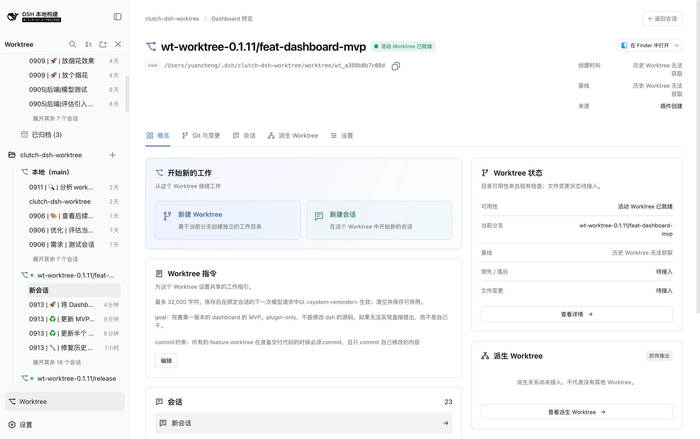

[English](README.md) | [简体中文](README.zh.md)

# @cerbur/clutch-dsh-worktree

`@cerbur/clutch-dsh-worktree` 为 DSH Web UI 增加 Git Worktree 视图，按 Workspace → Worktree
→ Session 组织会话，同时保留 DSH 对 Workspace 身份、Session 元数据、原生列表、消息和会话
历史的事实来源地位。

插件只在自己的 sidecar 中保存 Worktree 关系、获取事实和共享 Worktree 指令。对于受管理的
Worktree，插件还提供可选择本地 branch 基线的只读 Git 与变更 Dashboard；不会复制 transcript
或改写 DSH Session。

> **预览：** Worktree Dashboard 是仅 plugin 提供的早期 MVP 预览版。Worktree 导航、生命周期
> 操作、Session 操作、指令和受管理 Worktree 的 Git 与变更视图已经连接。派生 Worktree、设置和
> 其他未完成操作仍标记为**即将推出**。

## 安装

### 从 npm 安装

在已安装 DSH CLI 的环境中：

```bash
dsh plugin --profile web add @cerbur/clutch-dsh-worktree
dsh web
```

如果使用 DeepSeek Harness 源码 checkout 且没有独立的 `dsh` 命令，可使用等价的
`pnpm dsh` 形式。

### 从本地 checkout 安装

先构建本 package 和 DSH 源码 checkout，再用绝对路径添加 package：

```bash
cd /absolute/path/to/clutch-dsh
pnpm install
pnpm --filter @cerbur/clutch-dsh-worktree build

cd /absolute/path/to/deepseek-harness
pnpm install
pnpm run build
pnpm dsh plugin --profile web add /absolute/path/to/clutch-dsh/packages/clutch-dsh-worktree
pnpm dsh web
```

DSH Web profile 必须已经能够正常启动。修改 `package.json` 或 `cordis.patch.yml` 后，需要重新
执行绝对路径安装命令。

### 从 GitHub 源码安装（可选）

DSH plugin market 使用的源码依赖形式也可以直接安装：

```bash
dsh plugin --profile web add "github:Cerbur/clutch-dsh#path:/packages/clutch-dsh-worktree"
```

该方式会在安装时构建 package。pnpm 构建脚本授权和本地开发细节见
[docs/DEVELOPMENT.md](docs/DEVELOPMENT.md)。

## 功能

| 功能 | 预览 | 作用 |
| --- | --- | --- |
| **Worktree 导航** |  | 在 Sidebar 增加 Worktree 模式。每个 Workspace 下可以浏览 Local/Main 和 Git Worktree，再打开对应行绑定的 Session。 |
| **创建和导入 Worktree** |  | 从本地 branch 创建 Worktree，或原地登记已有的 branch-attached Worktree。导入不会移动、复制或编辑已有目录。 |
| **Worktree Dashboard** |  | 预览版 Dashboard 显示 Worktree 身份、路径、Session、指令、已连接操作，以及符合条件的受管理 Worktree 的只读 Git 与变更视图。派生 Worktree、设置和其他未完成卡片仍标记为**即将推出**。 |

## 使用

### 打开 Worktree 模式

1. 启动 DSH Web，在 DSH Sidebar 底部选择 **Worktree**。
2. 在 Worktree 树中搜索或展开 Workspace。
3. 选择 Local/Main 或某个 Worktree 浏览其 Session。这个视角是附加的，DSH 原生的 Workspace
   和 Session 导航仍然可用。每组初始显示五行，可使用**展开更多**和**收起**查看其余内容。
4. 使用 header 中的 **Collapse All** 折叠其他无关的 Workspace 和 Worktree，当前 Session 所在的
   Workspace 与 Worktree 保持展开。

### 创建 Worktree

1. 打开 Local/Main 或 active Worktree 的选项菜单，选择 **Create Worktree**。
2. 选择本地 base branch，也可以填写新的 branch 名称。
3. 确认弹窗。插件会创建 Git Worktree，记录获取事实；从该 Worktree 打开 Session 时继续执行
   正常的 Session 和 binding 流程。

Git repository、本地 branch 和 initial commit 必须可用。如果仓库尚未准备好，DSH 会显示对应
的 readiness 提示和可复制的 setup 指引。

### 导入已有 Worktree

1. 选择 Workspace，打开它的 `+` 操作，然后切换到 **Import**。
2. 从 branch 和 path 列表中选择候选项。
3. 选择 **Import Worktree**。插件会原地登记已有目录，不移动、复制或修改其中的文件，随后
   使用与新建 Worktree 相同的 Session 流程。

第一版只列出尚未被插件管理、状态 ready、绑定 branch 且不是 repository root 的 Git Worktree。
Detached、bare、prunable、缺失或无效条目会被省略。导入的 Worktree 仍可在选择本地基线 branch 后
使用 Git 与变更。

### 创建并打开 Session

- 在 Local/Main 上使用 **+**，创建运行目录为 Workspace root 的普通 DSH Session。
- 在 Worktree 上使用 **+**，创建运行目录为该 Worktree 的 Session。
- 如果存在完全匹配目标目录的未归档空白 Session，插件会尽量复用它。
- 可以使用 Session list、Worktree Session 菜单或 conversation 中的 DSH 原生 fork 操作。
  Worktree-bound Session 的 child 会绑定到同一个 Worktree，并在该视角打开。

如果 DSH 已创建 Session 但 binding 失败，Session 会被保留。Worktree 视图会提供重试或直接打开
的恢复操作；插件不会删除或改写 DSH Session。

### 打开 Worktree Dashboard

可以从 Local/Main 或 Worktree 行菜单、悬浮操作，或 Session 标题行原生操作旁边的 Dashboard
图标打开。Dashboard 是 Sidebar 旁边的 overlay，不会替代 DSH 原生 Session 页面，也不会创建
Session。

使用 **Back to session**、Escape、Sidebar 中的 Session 或退出 Worktree 模式关闭它。当前 MVP 已
连接的操作包括查看 Overview 和 Sessions、新建 Session 或 Worktree、归档 Worktree、编辑指令、
复制路径、在 VS Code 中打开记录的目录以及查看 Git 与变更。派生 Worktree、设置和其他标记的
快捷操作仍是占位内容。VS Code 必须安装在浏览器所在机器上且能够访问记录的路径；链接不会验证
应用是否成功启动。

### 使用 Git 与变更

从受管理 Worktree 的 Dashboard 打开 **Git 与变更** Tab。打开 Dashboard 或 Overview 不会请求
Git；第一次进入 Git Tab 时才通过现有 `/api` Connection 加载本地 branch 列表，并在选择基线后加载
commit history。Git 选择器仅在 Worktree 持久化的 `baseBranch` 存在且不同于当前 Worktree branch 时
将其作为默认值；这个值也显示在 Overview 的 Dashboard facts 中。要替换基线，可以点击 Base fact 旁的铅笔图标，再点击第一行搜索框展开响应式 branch 选择器；搜索固定在顶部，较小窗口中较长的 branch 列表会在受限区域内滚动。然后过滤 branch，
选择除当前 Worktree branch 之外的任一本地 branch，然后保存。保存会替换 plugin sidecar 中持久化的 `baseBranch`；下次打开 Git Tab 时，选择器
会以保存后的值作为默认值。Git Tab 打开后，直接修改其中的选择器仍只是临时查看选择，会重新加载
history、changed files 和 Diff，不会再次写入 Worktree 记录。如果尚未保存有效基线（包括基线等于当前
Worktree branch），Git Tab 会保持未选择状态并提示用户选择。即使没有选择 Git 基线，Overview 中的
身份、路径和 Session 信息仍然正常展示。

比较范围是所选 branch 当前指向的 commit 到 `HEAD`，每次读取都会重新解析 branch。浏览器不能直接
选择 commit SHA 或任意 Git ref；所选 branch 必须是 Worktree `HEAD` 的 ancestor，互不相关或已 rewrite
的基线会显示明确的不可用状态。`baseCommit` 仍作为兼容和恢复用的 acquisition 元数据保留，但不再
作为用户可选择的基线。当 Worktree 存在 staged、unstaged 或 untracked 文件时，列表顶部会加入
**未提交的改动**；选择它会将当前工作区与 `HEAD` 比较，并使用相同的变更文件和 Diff 视图。

**基线汇总**是一个独立的目标，默认展示从解析出的基线 commit 到本次请求捕获的 `HEAD` 的净已
提交树差异，不包含工作区未提交改动。打开 **包含工作区改动** 后，该目标会改为展示从基线
commit 到当前工作区的一次净差异，其中包含已提交、staged、unstaged、untracked、删除和重命名
改动。这是按需读取的新鲜 projection，而不是简单拼接两段 Diff。在 commit 列表中可以同时选择
多个已提交行，查看这些 commit 各自 first-parent delta 的精确并集。变更文件会记录贡献它的
commit；每个所选 commit 会作为独立 Diff segment 展示，不会隐式扩展成范围，也不会包含未选择的
commit。未提交改动 entry 与已提交的多选互斥。

历史最多展示 200 个 commit，更多内容会标记为 truncated。commit 详情使用 first-parent 比较，root
commit 与空 tree 比较，rename/copy 行保留两个路径；binary 或过大的 diff 会显示明确的安全状态。
**未提交的改动**是按需读取的临时快照，不会持久化，也不会持续监视 Git；刷新后才能看到后续编辑。

Git 与变更使用受页面 viewport 限制的固定尺寸三栏布局。较长的 commit list 和变更文件 list 会在各自
栏内滚动，不会继续撑大 Dashboard。变更文件按文件夹分组，文件夹默认展开，并且可以独立展开或折叠。
Diff 内容也会在固定尺寸的 Diff 栏内滚动；只读选择和刷新行为保持不变。

视图是只读的，不提供 commit 或 staging 控件。插件会依据所选 branch 到 `HEAD` 的 projection 验证
commit，并依据最新状态重新读取和授权工作区 path，因此这些 endpoint 不是通用 Git object 或文件读取器。
刷新会在替换数据加载期间保留 ready 内容；旧 commit 或文件选择的迟到响应会被忽略。

### 添加 Worktree 指令

在 Dashboard 的指令卡片上使用 **Edit** 保存或清空共享指引，长度上限为 32,000 个 UTF-16 代码
单元。存在 active binding 时，下一次模型请求会通过 DSH pre-step hook 收到独立的
`<system-reminder>` 上下文条目。

指令保存在 plugin 自己的数据中，不会写入项目目录或 `AGENTS.md`。清空、解绑、归档、清理或移出
管理后，后续请求不再注入；指令消息仍可见时，不变的指令不会重复追加。

### 归档或移除 Worktree

- **Archive Worktree** 是非破坏性操作，会保留目录、binding、指令和运行时 Worktree 上下文。
  Git 登记仍完整时，可以取消归档。
- **Clean Up Disk** 是单独的操作，需要二次确认，并执行普通的非强制 `git worktree remove`。
  插件不会检查 Session 或子代理是否仍在使用该目录；确认前请先停止这些任务。清理成功后
  binding 会 detached，记录会保留到之后显式移出管理。
- **Remove from Management** 只删除 plugin 的 Worktree 和 binding 记录，会保留磁盘文件和原生
  DSH Session，也不要求检查 Session 活动状态。

## 行为与限制

- DSH 拥有 Workspace 身份与根目录、Session 身份与元数据、原生列表、消息、prompt、transcript
  和历史。插件不会复制或改写这些数据。
- 插件外部索引保存 Worktree 路径、branch、来源、生命周期状态、binding、排序、指令、获取事实
  及相关元数据。对于受管理 Worktree，Dashboard Base fact 是持久化的 `baseBranch`；用户可以将其
  替换为除当前 Worktree branch 之外的本地 branch，保存后的值会成为 Git Tab 选择器的默认值。
  不可变的获取 `baseCommit` 与它分开保存，不会因该编辑被重写。索引位于 DSH host 的 plugin data
  directory，不写入项目目录或 DSH raw data，也不保存 Session 内容或 Workspace 根目录副本。
- runtime `cwd` 在每次执行时派生。无 binding、Main 或 detached binding 使用 Workspace root；
  active Worktree binding 使用 Worktree path。cwd 不会持久化写回 DSH Session metadata。
- 一个 Session 最多有一个 active Worktree binding，一个 Worktree 可以有多个 Session。移除或
  清理 Worktree 不会删除 DSH Session。失效的 active binding 会显示 repair 状态，不会静默切换到
  另一个 Worktree。
- Git 会在相关刷新、相关菜单打开和进入 Git Dashboard 时读取，插件不会持续监视 Git。外部切换
  branch 会显示 branch drift；清理磁盘前必须显式执行 **Adopt current branch**。Detached HEAD 和
  recovery-needed 状态会保持可见并支持重试。
- Worktree 健康状态通过 branch icon 的颜色显示：ready 使用 success（绿色）状态色，branch drift 使用警告色，repair/recovery-needed 使用错误色。即使 hover 时 icon 被 disclosure control 替换，本地化健康状态标签仍可供辅助技术读取。
- 新创建或新导入的 Worktree 会插入所属 Workspace 的 Worktree 列表队头；已有 Worktree 顺序保持不变，Main 固定在第一位。
- 将 Workspace、Main 和 Worktree 的展开选择保存到浏览器本地存储；Session 五行溢出展开保持临时状态，并在刷新或父级折叠后重置。**Collapse All** 会折叠其他无关节点并保留当前 Session 所在的 Workspace 与 Worktree 展开。
- 当前 Session 不在可见树中时，会高亮匹配行并临时展开定位；如果行已在可见区域内，不会移动导航滚动位置，否则只移动足够显示它的位置。且不改变已保存的展开选择。
- Git Dashboard 的读取由 Host 通过 DSH 现有 `/api` transport 执行。浏览器不会执行 Git、读取
- Git Dashboard 只实现 commit history、只读的**基线汇总**（可选包含一次从基线到工作区的
  新鲜 projection）、顶部的只读**未提交的改动**快照、changed files 和一次一个 unified diff。
  按请求启用时，这些 projection 会合并 staged、unstaged 和 untracked 文件，但不会写回 Git。
  Dashboard 不提供 commit、staging、reset、revert、cherry-pick、fetch、push、pull、pull request、
  graph lanes、pagination 或 syntax highlighting。
- Session 行使用 DSH 原生的状态和相对时间展示。折叠的 Workspace、Main 和 Worktree 分组会
  从完整且符合原生空白/归档可见性条件的成员中选择一个聚合 `StateDot`：等待审批（以及其他 pending interaction warning）
  优先于运行中，运行中优先于已完成。Idle Session 不会贡献分组 dot；Worktree 健康状态仍
  使用独立的前置指示器。视觉上的 Session 排序初始按最新的 `updatedAt` 值排列并只保存在浏览器本地；Main 固定为首行，Worktree 拖拽只
  更新这个本地排序投影，Main 拖拽只有在 DSH 接受后才更新原生 Workspace 顺序。
- active Worktree Session 在明确确认后可以请求名为 `worktree-full-access` 的 preset。它将
  DSH `danger-full-access` 与 `ask` 组合，保留审批提示，不改变 network 或 process policy。
  不可用时尽可能回退到 `workspace-write + ask`，否则显示未验证且可重试的状态；它不能突破
  DSH 宿主设置的 sandbox 上限。
- Git 必须已安装且可在 PATH 中使用。Git 可执行文件缺失时显示安装提示且不显示命令块；插件
  不会执行 setup 或安装命令。

## 要求

| 组件 | 要求 |
| --- | --- |
| DSH Client | `>=0.1.5-rc.1`，需要 Session/Workspace Controller 和 Client Store |
| DSH Host | `>=0.1.5-rc.1`，需要 Typert Gateway `/api` connection 和 subprocess capability |
| Git | `>=2.20.0`，必须已安装且可在 `PATH` 中使用 |
| Node.js | `>=20.0.0`，用于 DSH host runtime |

## 界面语言

Worktree 模式跟随 DSH 当前界面语言。入口、树、菜单、弹窗、状态、Dashboard 标签和重试提示
提供英文和中文。Workspace 名称、Session 标题、branch、路径以及原始 DSH 或 Git 错误保留原值。

## 开发

架构、本地 DSH 联调、测试和贡献流程见：

- [docs/ARCHITECTURE.md](docs/ARCHITECTURE.md)
- [docs/DEVELOPMENT.md](docs/DEVELOPMENT.md)
- [docs/RELEASING.md](docs/RELEASING.md)
- [AGENTS.md](AGENTS.md)
- [src/client/README.md](src/client/README.md)

常用的 package 检查命令：

```bash
pnpm --filter @cerbur/clutch-dsh-worktree typecheck
pnpm --filter @cerbur/clutch-dsh-worktree build
pnpm --filter @cerbur/clutch-dsh-worktree test
```

中英文 README 的结构通过以下测试校验：

```bash
node --test test/readme-parity.test.mjs
```

## 卸载

使用 DSH CLI：

```bash
dsh plugin --profile web remove @cerbur/clutch-dsh-worktree
```

如果使用 DeepSeek Harness checkout，可对同一个 package name 使用
`pnpm dsh plugin --profile web remove`。

## 友情链接

- [LINUX DO](https://linux.do/) — 新的理想型社区。
