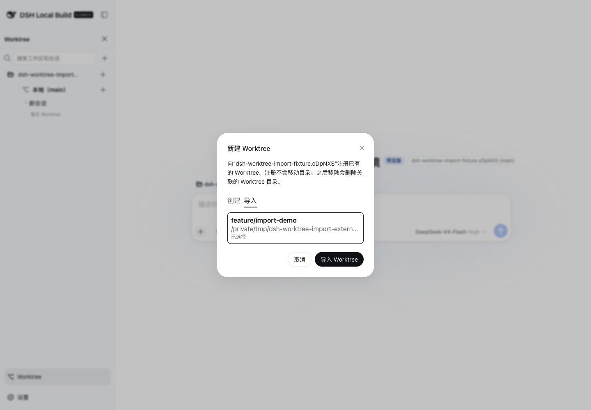

# @cerbur/clutch-dsh-worktree

`@cerbur/clutch-dsh-worktree` 为 DSH Web UI 增加 Git Worktree 视图，按
Workspace → Worktree → Session 组织会话，同时继续由 DSH 作为 Project/Workspace 身份、
Session 元数据、原生列表和会话历史的唯一事实来源。插件只保存 Worktree/Session 的外部
关系元数据。

## 界面截图


中文截图展示了侧边栏中的 Worktree 模式、包含 Main 和 Worktree 行的 Workspace 树，以及
新会话空白 Hero 中的只读上下文。



导入截图展示了现有 Workspace `+` 弹窗：默认选中创建，旁边是导入 Tab，并在普通下拉框中
使用安全的示例 branch 和路径值。

## 能力

- 从 DSH Sidebar footer 进入 Worktree 模式，按 Workspace → Worktree → Session 浏览会话。
- 搜索 Workspace，并从已有 local branch 创建 Git Worktree 和 branch。
- 在同一个弹窗中选择导入，发现与当前 Workspace repository 关联、尚未由 sidecar 管理且绑定 branch 的 Git Worktree。第一版不展示 repository root 和 detached HEAD 条目。
- 导入只登记已有 Worktree，不移动、复制或编辑其目录；记录使用 `source: external`，之后与 plugin 创建的记录共享 Session、binding、health、排序、cwd、projection、刷新和恢复流程。
- plugin 创建和导入的 Worktree 都通过真实的 `git worktree remove` 移除；移除导入的 Worktree 可能删除其关联目录，确认弹窗会明确提示。
- 在 Main 或 active Worktree 下创建普通 Session 或 Worktree Session，并直接打开新会话。
- 对 active Worktree Session，先经明确确认，再请求命名的 `worktree-full-access` 预设。它将
  DSH 的 `danger-full-access` 与 `ask` 组合：关闭关联 Git 元数据的文件系统限制，但保留
  审批提示；网络和进程策略不变。原生 Access 菜单中的 `Worktree Full Access` 会显示
  Worktree branch 图标。
- 保留用户在 DSH 原生 Access 界面中选择的限制。如果自定义预设不可用，在可能时回退到
  `workspace-write + ask`；如果无法验证权限能力，则显示可重试的降级状态，不伪称已获得完全访问。
- 复用原生动画 `StateDot` 展示运行中的 Session，并为最近一条用户发送的 Session 消息显示
  原生相对时间；hover 或打开菜单时，右侧位置让位给已有的操作菜单。
- 使用 DSH 原生 Session hover 详情卡片展示完整标题、相对时间和当前状态；打开 Session 操作
  菜单或拖拽行时，详情卡片让位。
- 补齐原生的等待审批、计划待审、等待回答、已完成、空闲和运行中子代理状态；插件不会复制
  原生动画实现。
- 当折叠的 Workspace、Main 或 Worktree 中存在任一未归档的活动 Session 时，在其右侧显示
  一个原生运行指示器；展开后恢复普通操作栏。
- 用户在 Session 中发送新消息后，该 Session 会移动到当前 Main 或 Worktree 视觉分组的队首。
  该排序只保存在浏览器本地，不修改 DSH Workspace 顺序或 Worktree sidecar。
- 查看 ready、repair、active 和 detached Worktree 状态，包括可重试的操作错误。
- 通过 Main 和 Worktree 共用的选项菜单复制所选行的绝对路径；Main 和 detached 行只显示“复制路径”，
  active Worktree 额外显示“移除 Worktree”并要求确认。
- 通过 Local 或 active Worktree 的选项菜单创建新的 Worktree。创建弹窗会以所选行的当前 branch
  为基线，并预填下一个可用的递增名称，例如 `feature-2` 或 `feature-3`；detached Worktree
  不显示该动作。
- 继续使用 DSH 原生的 Workspace rename/delete/reorder 和 Session 菜单。Worktree 可以在所属
  Workspace 内排序；顺序保存在插件 sidecar 中，Main 固定在第一位。
- 将 Workspace、Main 和 Worktree 的展开选择保存到浏览器本地存储；Session 五行溢出展开保持临时状态，并在刷新或父级折叠后重置。
- 在 Worktree view 高亮 DSH 当前 Session；进入 Worktree 模式或切换当前会话时，临时展开其 Workspace/Main/Worktree 路径；只有当前行不在前五行时才展开 Session 五行溢出，随后清空隐藏它的搜索并滚动定位；这一浏览器本地行为不改变已保存的展开选择。
- 在已有 Conversation 的标题行以及新会话空白 Hero 中，以只读方式显示当前 local branch 或
  Worktree branch 上下文。
- 在同一个 Session 的 snapshot 更新以及 Session 切换期间保持 Conversation 和 Hero 上下文
  稳定；替换读取进行时保留上一次有效上下文。
- 过长的 branch 名称在 chip 中折叠，并通过原生 hover card 展示完整值；Sidebar footer action
  对齐原生字体和排版，Sidebar 折叠后不再额外显示 `WT` 按钮。
- Worktree Session 仍出现在原始 DSH Project/Workspace 视角中；插件不复制 Session 内容，
  也不修改消息、prompt、transcript 或历史记录。

### 兼容性与前置条件

- 开发和源码验证应使用官方 [DeepSeek Harness 仓库](https://github.com/deepseek-ai/deepseek-harness)
  的干净 checkout，并跟随仓库当前默认分支。该仓库当前使用 `master` 而不是 `main`，且仍是
  developer preview，package 和 API contract 可能变化；在向 profile 安装本 plugin 前，先完成
  upstream 的安装和构建步骤。
- 目标 profile（例如 `web` 或 `demo`）必须已经可以正常启动，且 plugin 必须安装到实际
  启动 Web UI 的同一个 profile。
- DSH Client 必须提供原生 `@deepseek-ai/dsh-client-ui-conversation` package 及其
  `conversation.session.header.actions` seat。
- Worktree 操作要求 Git 已安装且可在 PATH 中使用。Workspace 必须位于 Git repository 中，
  且至少有一个初始 commit 和本地 branch。Git 可执行文件缺失时显示安装提示且不显示命令块；
  缺少 repository、初始 commit 或本地 branch 时显示可复制的 setup 命令。插件不会执行 setup
  或安装命令，也不会修改 Workspace 文件。
- package 声明了可安装的 `dsh.bundle` 并提供 `cordis.patch.yml`；浏览器 UI 通过
  `dsh.client` metadata 声明。

## 安装

普通用户安装请使用 npm package。开发或验证本地源码时使用仓库 checkout；从市场条目安装
源码 package 时使用 GitHub source path。

### 从 npm 安装（推荐）

在已经安装 DSH CLI 的环境中执行：

```bash
dsh plugin --profile web add @cerbur/clutch-dsh-worktree
dsh web
```

如果使用 `deepseek-harness` 源码 checkout、系统没有独立的 `dsh` 命令，使用等价的转发
形式：

```bash
cd /path/to/deepseek-harness
pnpm dsh plugin --profile web add @cerbur/clutch-dsh-worktree
pnpm dsh web
```

可以通过官方 registry 查看当前发布版本：

```bash
npm view @cerbur/clutch-dsh-worktree version --registry=https://registry.npmjs.org/
```

### 准备当前 upstream DSH checkout

进行源码开发或验证时，先准备 upstream checkout。当前 upstream 默认分支是 `master`；如果仓库
未来切换默认分支，应跟随仓库的当前默认分支。

```bash
git clone https://github.com/deepseek-ai/deepseek-harness.git
cd deepseek-harness
git fetch origin
git pull --ff-only origin master
pnpm install
pnpm run build
```

### 从仓库 checkout 安装

先从 `clutch-dsh` checkout 构建 package，再把绝对路径安装到 DSH profile：

```bash
cd /path/to/clutch-dsh
pnpm install
pnpm --filter @cerbur/clutch-dsh-worktree build

cd /path/to/deepseek-harness
pnpm install
pnpm run build
pnpm dsh plugin --profile web add /path/to/clutch-dsh/packages/clutch-dsh-worktree
pnpm dsh web --dump-config
pnpm dsh web
```

`--dump-config` 输出中应包含该 plugin 的 bundle layer。如果 profile 中仍有旧的 unscoped
安装，先移除：

```bash
pnpm dsh plugin --profile web remove clutch-dsh-worktree
```

更新本地 checkout 时，重新构建 package 并重启 DSH：

```bash
cd /path/to/clutch-dsh
pnpm --filter @cerbur/clutch-dsh-worktree build
cd /path/to/deepseek-harness
pnpm dsh web
```

修改 `package.json`、`cordis.patch.yml` 或 profile bundle 成员后，需要再次执行 plugin add
命令。

### 从 GitHub 源码安装

`awesome-dsh-plugin` 生成的源码路径为：

```bash
dsh plugin --profile web add "github:Cerbur/clutch-dsh#path:/packages/clutch-dsh-worktree"
```

这是源码 Git 依赖，不是预构建的 npm package。它的 `prepare` 生命周期会生成 `lib/`。当前
DSH profile 使用 pnpm 11 的 `allowBuilds`：首次执行 Git 安装时，pnpm 会故意拒绝构建，并
在错误信息中打印包含包名、Git URL、解析后的 commit 和子目录 path 的完整 key。将完整
key 复制到 profile 的 `pnpm-workspace.yaml`，例如：

```yaml
allowBuilds:
  '@cerbur/clutch-dsh-worktree@git+https://github.com/Cerbur/clutch-dsh#<resolved-commit>&path:/packages/clutch-dsh-worktree': true
```

必须使用 pnpm 错误提示中打印的完整包 key：`<resolved-commit>`、Git URL 和 path 都必须与
错误输出一致。对于直接 Git 依赖，只写包名不够；当前 pnpm 11 的 Git prepare 流程也不使用
`onlyBuiltDependencies` 这一配置。保存授权后重新执行原安装命令；commit 变化后需要为新
commit 增加对应的 key。该 allowlist 属于信任此 Git commit 的 profile 维护者，不要写入
plugin package。

授权后，Git prepare 会在 checkout 的 monorepo 中执行 `pnpm install`，再执行
`pnpm run build`，因此 profile 必须能访问其配置的 registry。授权之后出现 registry DNS、
镜像或 lockfile 错误，属于安装环境问题，不是 `allowBuilds` 拒绝。若要避免源码构建授权，
请使用上面的 npm 安装方式。

### 卸载

```bash
cd /path/to/deepseek-harness
pnpm dsh plugin --profile web remove @cerbur/clutch-dsh-worktree
```

## 使用说明

### 打开 Worktree 模式

1. 启动 DSH Web UI，在 Sidebar footer 选择 Worktree。Worktree 模式是附加界面，不会添加
   独立的 Workspace/Worktree Tab。
2. 使用 Workspace 树搜索、展开并选择 Main 或 Worktree 视角。每组默认显示五行，更多内容
   使用 Expand more/Collapse。


上图展示了侧边栏入口以及新会话空白 Hero 中显示的视觉上下文。界面语言跟随 DSH 当前的
语言设置。

### 创建 Worktree

1. 选择 Workspace，点击它旁边的 `+`，选择基线 local branch，并填写 Worktree name。默认
   branch 名称为 `dsh/<8-character-random-string>`。
2. 如果要从已有 Worktree 创建同级 Worktree，打开该 active Worktree 的选项菜单并选择
   `创建新的 Worktree`。弹窗会以当前 Worktree branch 作为基线，并为名称选择下一个可用的
   递增序号；已有名称会被跳过。
3. 目标 Worktree 路径必须是绝对路径，属于同一个 Project，且不能是 Project 根目录。相对
   路径、其他 Project 的路径或 Project 根目录都会被拒绝。
4. Git 必须已安装且可在 PATH 中使用。Git 可执行文件缺失时显示安装提示且不显示命令块；请
   安装 Git、重启 DSH 后重试。如果缺少 repository、初始 commit 或本地 branch，按照弹窗中
   的可复制 setup 命令修复后重试。插件只展示这些提示，不会执行 setup 或安装命令或编辑
   业务文件。

### 导入已有 Worktree

1. 选择 Workspace，点击旁边的 `+`，再选择 `导入` Tab。弹窗通过现有 DSH `/api` Connection
   加载该 repository 的 Git Worktree 候选项。
2. 第一版只列出绑定 branch、不是 repository root、且未出现在 plugin sidecar 中的 Worktree。
   detached HEAD 会被省略；候选项通过普通下拉框选择，每个选项先显示 branch，再显示绝对路径
   作为诊断信息。
3. 在下拉框中选择一个选项并点击 `导入 Worktree`。登记只写入 plugin sidecar，已有 Worktree 目录和 Git
   工作状态保持不变。随后会在该 Worktree cwd 创建或复用 Session，并执行与创建相同的
   `bind → open → binding refresh` 流程；新建 Session 不会在 binding 刷新前投影到原生
   Workspace membership。
4. 同一 Workspace、同一物理路径的 active external 导入是幂等的。已经由 plugin 管理的路径
   返回 `WORKTREE_ALREADY_MANAGED`；无效或过期候选项返回 `WORKTREE_IMPORT_INVALID`，修复
   repository 状态后可以重试。

### 创建 Main 和 Worktree Session

- 使用 Main 的 `+`，在 Project 根目录视角中创建普通 DSH Session。
- 使用 Worktree 的 `+`，创建或复用 runtime cwd 指向该 Worktree 的 Session。插件通过 upstream
  runtime 调用 `session.create({ cwd: worktreePath })`，随后保存外部 binding 并打开该 Session。
  当前浏览器内的 `{ workspaceId, sessionId }` membership projection 会在之后刷新，因此新建
  Session 不会短暂出现在 Main 中。
- 如果存在目标 cwd 完全匹配的未归档 blank Session，连接器会优先复用它。已绑定的 Session
  会直接打开；未绑定的候选会先 binding，再 projection 和打开。否则执行
  新建路径执行 `create → bind → open → refresh`，同一个 Worktree 的并发点击会合并。
- 如果 DSH 创建 Session 后 binding 失败，Session ID 仍会保留，可用于 Retry 或 Open 恢复。
  插件不会删除或修改该 DSH Session。
- 打开 active Worktree Session 前，插件会在 DSH 风格的页面内弹窗中说明关联 Git 元数据为什么
  可能需要访问 Session 目录之外的内容。弹窗要求明确勾选风险确认；取消会保留 Session 和
  binding，不改变权限，并留下可重试的待处理状态。需要切换到其他权限模式时，继续使用 DSH
  原生 Access 选择器。
- provisional blank Session 遵循 DSH 原生显示规则：只在当前选中的视角中显示，使用本地化
  的 `New Session` 文案，不显示生成的 ID，也没有 Rename、Fork 或 Archive 菜单。接受第一条
  prompt 后，它会变为普通 Session 行；隐藏 blank 行不会删除 Session 或 Worktree binding。

### Session 活动与排序

- Session 行复用 DSH 原生 `StateDot`：运行中的 Session 以及存在运行中子代理的 Session，使用
  右侧动画点替代相对时间。等待审批、计划待审和等待回答使用原生 warning 点；已完成 Session
  保留原生 completed 点。
- 右侧元数据使用原生紧凑时间单位（刚刚、分钟、小时、天、月、年），来源是 DSH 的
  `updatedAt`，该字段随最近一条用户消息推进；空白 New Session 不显示时间。时间只在 snapshot
  render 时按原生规则重新计算，不额外增加每分钟 ticker。
- 将鼠标悬停在 Worktree Session 行上 500 毫秒后，会打开原生详情卡片，展示完整标题、相对时间
  和状态；Session 菜单打开或行正在拖拽时不显示卡片。
- 折叠的 Workspace、Main 或 Worktree 分组，只要任一未归档成员正在运行就显示相同的原生运行点，
  即使该 Session 被搜索隐藏也会计入。展开后隐藏聚合点；hover、focus 或打开菜单时显示原有
  操作控件。
- 用户发送新消息后，Session 会移动到当前 Main 或 Worktree 视觉分组队首。promotion、已观察
  时间戳和每组顺序只存在浏览器本地；手动拖动仍先调用 DSH 原生排序 API，成功后再更新本地顺序。

### 排序与管理 Worktree

- 在所属 Workspace 内拖动 Worktree。排序持久化在 plugin sidecar 的有序 `worktrees` 数组中；
  Main 是固定的第一行，Worktree 不能跨 Workspace 移动。
- 打开 Main 和 Worktree 共用的选项菜单复制所选行的绝对路径。Main 和 detached/removed Worktree
  只显示“复制路径”；active Worktree 还显示“移除 Worktree”并要求确认。
- 导入的 Worktree 与 plugin 创建的 Worktree 显示相同的 active 选项菜单。两种来源都执行真实
  `git worktree remove`；导入项的确认文案会警告关联 Worktree 目录可能被删除。Session 会
  保留为 detached binding。
- 移除 Worktree 不会删除其 Session。关系会保留为 detached，直到显式解绑。删除 Workspace
  只会删除 DSH 的 Workspace registration；其目录、Session、Git Worktree 和 plugin
  sidecar 会保留。
- Worktree 成功移除后，如果公共 DSH 权限服务可用，仍处于完全访问的 detached Session 会
  归一化为 `workspace-write + ask`。权限服务不可用时显示未验证且可重试的警告；不会向
  detached Session 自动授予完全访问。
- DSH 原生的 Workspace rename/delete/reorder 和 Session 菜单继续可用。Session 拖动排序
  限定在当前视觉 Main 或 Worktree 分组中。
- Main 分组显示当前 local branch：有分支时为 `本地（branch）`，DSH 没有返回当前分支时
  回退为 `本地`。如果导入的 Workspace 是 Git 仓库中的子目录，会先解析 Git 根目录，再
  复用与 Git 根目录相同的 branch/worktree 信息。branch 名称、路径、Workspace 名称、Session
  标题以及原始 DSH/Git 错误信息保持原值。
- 已有 Session 会在标题行显示只读上下文，格式为 `Session title` → `Agent mode` →
  `current branch / Worktree branch`。过长值在紧凑 chip 中折叠，并通过 hover card 显示完整
  内容。原生标题存在且有锚点时，新会话空白 Hero 会在标题后显示 `Workspace (branch)`，并
  提供相同的完整值 hover card。
- Sidebar 折叠后，footer 保留原生的 icon-only action 尺寸和排版；插件不会再绘制独立的
  `WT` rail control。

### 理解状态与恢复提示

- `ready` 表示 Worktree 可用。`repair` 表示 Worktree、Session、binding 或 cwd 缺失/无效。
  `detached` 表示 Git Worktree 已被移除，但关系仍然保留。active binding 指向缺失
  Worktree 时会显示明确的 repair 警告或错误，不会静默切换到其他 Worktree。
- Worktree health 是 Git 的运行时 projection，不写入 sidecar。Git 前置条件失败按
  Workspace 显示提示：Git 可执行文件缺失时显示安装提示且不显示命令块，缺少 repository、
  初始 commit 或本地 branch 时显示可复制的 setup 命令。Connection、Gateway 和未预期的
  Worktree domain 错误会保留为可重试错误，不会伪装为空列表。
- 已经 ready 的视角刷新时会保留当前 projection，直到替换数据可用。同一个 Session 的
  snapshot 更新不会清空上下文，也不会触发重复读取；没有缓存视角时，首次进入和显式 Retry
  可以显示 loading 状态。
- 权限状态会明确显示为完全访问、回退到 `workspace-write`、保留用户限制、能力未验证、
  等待确认或可重试的设置失败，不会静默折叠为空列表或伪造成功。

## 界面语言

Worktree 模式跟随 DSH 当前界面语言。语言偏好由 DSH 管理；插件不增加独立的语言设置。
Worktree 入口、Workspace → Worktree → Session 树、菜单、弹窗、状态和重试提示均提供中文
和 English 文案。

Workspace 名称、Session 标题、branch 名称、路径以及 DSH/Host 返回的原始错误信息保持不变，
便于诊断和继续使用 DSH 原生数据。Main 分组在 English 中本地化为 `Local (branch)`，中文
为 `本地（branch）`；没有返回当前 branch 时分别回退为 `Local`/`本地`。

## 数据边界与当前限制

DSH 管理原始 Project/Workspace 身份和根目录、Session 身份和元数据、原生 Project/Session
列表、消息、prompt、transcript 和历史记录。插件不会复制或重写这些内容。插件的外部索引
位于 DSH host 的 plugin data directory 或独立 sidecar 存储中，只能包含以下关系事实：

- `projectId`、`worktreeId` 和 `sessionId`；
- 绝对 Worktree 路径、branch 和生命周期状态；
- Worktree 来源（`plugin` 或 `external`）；
- binding 状态和 schema version。

索引不会写入 Project 工作树或 DSH 原始数据目录，也不会保存 `projectRoot` 副本或任何
Session 内容。如果 sidecar 不可用或损坏，原生 Project/Session 视角仍然可读，插件进入
degraded/read-only 状态；不能用空索引覆盖 DSH 原生列表。

一个 Session 最多绑定一个 active Worktree，一个 Worktree 可以绑定多个 Session。Session
重复绑定同一个 Worktree 是幂等的，绑定两个 active Worktree 会产生 conflict。没有 binding、
使用 Main binding 或处于 detached binding 的 Session 使用 Project 根目录作为 cwd；active
Worktree binding 使用对应的 Worktree 路径。cwd 在每次执行时派生，不会写回 DSH Session 元数据。

创建 Worktree 时先创建 Git Worktree，再记录外部关系。sidecar 写入失败时会尽可能清理刚
创建的 Git Worktree。删除 Worktree 失败时不会改变 sidecar 状态，因此关系仍可重试。创建
Session 时先调用 DSH 原生 API，再写入 binding；binding 失败不会删除或修改已创建的 Session。

Worktree Session 流程将独立的 Worktree cwd 交给 upstream DSH runtime，并将
`{ workspaceId, sessionId }` 保持为浏览器本地 membership projection，而不是持久化的 DSH
attach。它不会修改 DSH 源码、Session metadata 或原生 Workspace 存储。native list 刷新后会
重放 projection；binding 消失或 Client dispose 时会移除 projection。

权限变更只使用 DSH 公共的 per-Session 权限服务及其 `permission/preset`、`sandbox/mode`、
`approval/policy` 记录。插件不会写入消息、prompt、transcript、Workspace 数据或 Session
metadata，也不能扩大运行 DSH 的宿主沙箱边界。

空白 Hero 上下文只用于展示。由于当前 upstream DSH source checkout 没有 additive Hero
headline slot，它的位置依赖原生 `[data-phase="hero"]` 和标题锚点；锚点不可用时浮层会消失，
未来有正式 DSH slot 时应迁移到该 slot。

## 开发与验证

从 workspace 根目录执行：

```bash
cd /path/to/clutch-dsh
pnpm install
pnpm run check:workspace
pnpm run check:patches
pnpm --filter @cerbur/clutch-dsh-worktree typecheck
pnpm --filter @cerbur/clutch-dsh-worktree build
pnpm --filter @cerbur/clutch-dsh-worktree test
```

验证双语 README contract 和格式：

```bash
cd /path/to/clutch-dsh/packages/clutch-dsh-worktree
node --test test/readme-parity.test.mjs
pnpm exec prettier --check README.md README.zh.md test/readme-parity.test.mjs
```

完整 workspace 检查为：

```bash
cd /path/to/clutch-dsh
pnpm run check
```

不要提交生成的 `lib/`、coverage、sidecar 数据或本地凭据。数据边界和生命周期规则见
[AGENTS.md](AGENTS.md)，版本与安装来源见 [docs/RELEASING.md](docs/RELEASING.md)，浏览器
Consumer 边界见 [src/client/README.md](src/client/README.md)。

## 插件市场描述

向 `awesome-dsh-plugin` 投稿时使用 `git` 分类，并保持描述与 package 一致：

```yaml
category: git
description:
  en: Adds a Worktree view to DSH Web UI that groups Sessions by Git worktree while keeping DSH as the source of truth.
  zh: 为 DSH Web UI 增加按 Git Worktree 组织 Session 的视角，同时继续由 DSH 管理原始 Project/Workspace 和 Session 数据。
```

市场投稿还需要在外部确认 `dsh-plugin` topic、仓库年龄和提交数等信息；这些外部属性无法
由 package README 设置。
