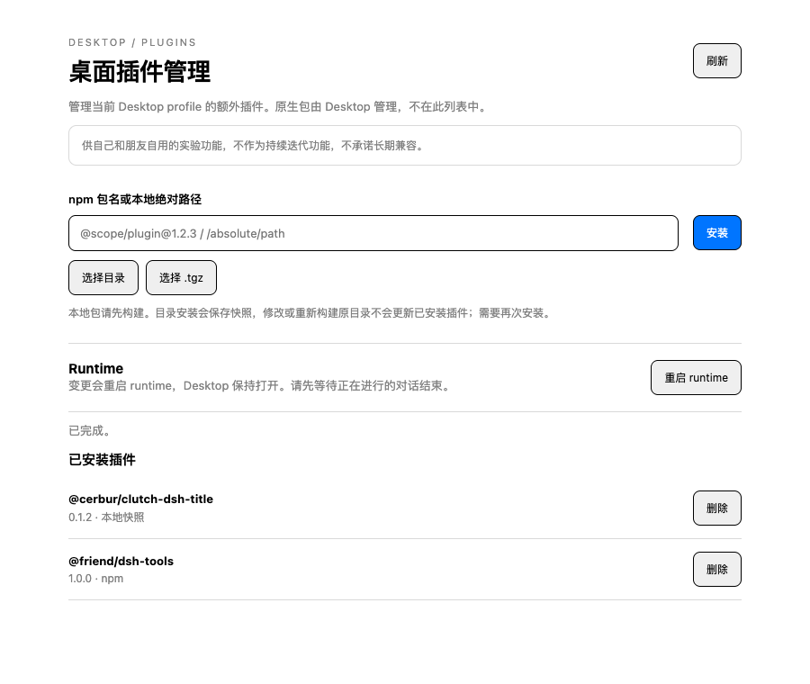

# Desktop local packager

**For personal use by the author and friends. This is not a continuously developed
feature; ongoing maintenance and compatibility with future DSH versions are not
promised.**

Builds a self-contained Apple Silicon `DeepSeek Harness.app` with embedded Node,
pnpm, offline seed and an Electron plugin manager. All implementation lives in
`scripts/desktop-packager/`. It adds no workspace plugin package and does not edit
tracked DSH source. See [the full build instructions](README.md).

## Build and install

Use the Node/pnpm versions required by the selected DSH checkout, macOS arm64,
Xcode command line tools and Python 3. Network access is required for initial
dependencies. Quit the existing app before installing.

```bash
./scripts/desktop-packager/package-desktop.sh /path/to/deepseek-harness
```

Without a source path, the script shallow-clones upstream. `DSH_SOURCE_REF`
selects its ref; `DSH_INSTALL_DIR` changes the installation parent. Existing apps
are preserved with a `.previous` suffix; an existing backup blocks replacement.

The dsh and vendor families use upstream `release:pack --concurrency` with four
packing workers by default, and report each family's elapsed time. Set
`DSH_PACK_CONCURRENCY` to a positive integer, or `1` for serial packing. Validation
runs before fetching DSH source or building. This setting affects only family
packing; compilation, payload checks and offline seed verification still run.
Tarballs are regenerated in full; previous packed outputs are not reused.

```bash
DSH_PACK_CONCURRENCY=4 ./scripts/desktop-packager/package-desktop.sh /path/to/deepseek-harness
```

For the `curl | bash` installer, put `DSH_PACK_CONCURRENCY=4` before `bash` on the
right side of the pipe. The selected upstream pack script must support
`--concurrency`.

The manager is included automatically. The packager compiles checked temporary
Desktop main/project-manager overlays and copies this directory's renderer into
the generated app before ad-hoc signing. Upstream structural changes fail the
build. This is not a notarized distribution or a supported auto-update channel.

## Plugin management

Open Desktop's plugin menu or press Cmd+,. This is a separate Electron window,
not a Web Settings tab or an installable DSH plugin.



- Install an npm name, version or tag, e.g. `@scope/plugin@1.2.3`. Installing the
  same name again updates it or changes its source.
- Select a built directory or `.tgz` archive, or enter an absolute path (spaces
  supported) or `file:/absolute/path/plugin.tgz`. Selecting only fills the input;
  installation starts when you click Install.
- Local packages must provide `package.json`, `dsh.bundle.patch`, and built
  exports. Directory packing uses bundled pnpm and skips lifecycle scripts.
  Build first. Runtime dependencies using `workspace:`, `file:`, or `link:`
  must be published or bundled first.
- Only extra plugins appear. Removal requires confirmation. Core packages are
  protected against installation, updates and removal.
- Restart runtime stops/recreates the Host and reloads the main view while the
  Electron shell stays alive. Successful package changes also switch runtime.
  Finish active conversations first; in-progress generation is not preserved.

Local archives are content-addressed under
`$DSH_HOME/desktop/local-packages/` (normally
`~/.dsh/desktop/local-packages/`). Deleting/moving the original directory does not
affect installed snapshots. Rebuild and reinstall to update. Uninstall retains
snapshots because rollback profiles may still reference them.

Archives cannot contain links or special files. Limits: 128 MiB compressed,
512 MiB expanded, 50,000 entries. Desktop's dependency build-script policy still
applies. Packages requiring additional install scripts can be rejected. Uncached
dependencies need network access even for local packages.

The source of truth remains the Desktop profile's `package.json` dependencies
and `dsh.profile.bundles`. Local specs survive release migration instead of being
converted to registry versions. Native locking, staging, health checks and
rollback are retained. Removal reads the installed inventory from the active
profile instead of reinstalling all dependencies in staging, so a missing local
archive does not prevent uninstalling its plugin. Snapshots are published with an
atomic rename; reinstalling verifies and repairs an incomplete cached archive.
Management operations and manual restarts are serialized. Errors remain visible
and can be retried. A health check can briefly disconnect the main view.

Native application update installation is outside this experiment's operation
queue; avoid running it together with plugin management.

## Validation

```bash
DSH_REPO_ROOT=/path/to/deepseek-harness node --test scripts/desktop-packager/*.test.mjs
node scripts/desktop-packager/preview.mjs
```

Tests require the selected DSH checkout's installed dependencies and built
Desktop. They use real pnpm and synthetic packages in temporary profiles,
covering local installs, removal, source deletion, release migration, rollback,
IPC validation and temporary overlay compilation.

The [browser preview](http://127.0.0.1:43188) uses in-memory data only. Add
`?lang=en` for English; enter `fail` to simulate an installation error.
It does not verify actual Electron integration or a full signed App build.
See [PLAN.md](PLAN.md).

For opt-in real Electron integration, first prepare the selected DSH checkout's
mac-arm64 runtime, seed and Desktop build, then run:

```bash
DSH_REPO_ROOT=/path/to/deepseek-harness node scripts/desktop-packager/electron-smoke.mjs
```

The test uses temporary `DSH_HOME` and Electron userData directories. It starts the
real Host and verifies install, uninstall and runtime restart through the actual
preload/IPC, including process and window state. It never uses the user's profile.
Temporary data is removed by default; set `CLUTCH_KEEP_SMOKE=1` to retain it for
diagnosis. This does not replace final signed-App installation verification.
